<!-- vim-markdown-toc GFM -->

* [30days make a os](#30days-make-a-os)
	* [Progress](#progress)
		* [day05 包括之前的处理](#day05-包括之前的处理)
		* [day06 分割编译与中断处理](#day06-分割编译与中断处理)
		* [day07 FIFO 与鼠标控制](#day07-fifo-与鼠标控制)
		* [day08 鼠标控制与 32 位模式切换](#day08-鼠标控制与-32-位模式切换)
		* [day09 内存管理](#day09-内存管理)
		* [day10 叠加处理](#day10-叠加处理)
		* [day11 制作窗口](#day11-制作窗口)
		* [day12 定时器](#day12-定时器)
		* [day13 继续优化定时器](#day13-继续优化定时器)
		* [day14 提高分辨率和键盘输入](#day14-提高分辨率和键盘输入)
		* [day15 多任务并发](#day15-多任务并发)
		* [day16 继续多任务](#day16-继续多任务)
		* [day17 实现命令行窗口](#day17-实现命令行窗口)
		* [day18 终端命令](#day18-终端命令)
		* [day19 应用](#day19-应用)
		* [day20 API](#day20-api)
		* [day21 保护操作系统](#day21-保护操作系统)
		* [day22 编写 C 语言应用程序](#day22-编写-c-语言应用程序)
		* [day23 图形处理相关](#day23-图形处理相关)
		* [day24 窗口操作](#day24-窗口操作)
		* [day25 增加命令行窗口](#day25-增加命令行窗口)
		* [day26 为窗口移动提速](#day26-为窗口移动提速)
		* [day27 LDT 与库](#day27-ldt-与库)
		* [day28 文件操作与文字显示](#day28-文件操作与文字显示)
	* [TODO](#todo)
		* [终端](#终端)
			* [vi mode](#vi-mode)
				* [INSERT 模式](#insert-模式)
				* [NORMAL 模式](#normal-模式)
				* [REPLACE 模式](#replace-模式)
				* [VISUAL 模式](#visual-模式)
				* [V-BLOCK 模式](#v-block-模式)
				* [V-LINE 模式](#v-line-模式)
		* [操作系统](#操作系统)

<!-- vim-markdown-toc -->

# 30days make a os
- just note my daily practice
- day01 ~ day04 were missing because this repo was created at the very 5 day

## Progress
### day05 包括之前的处理
### day06 分割编译与中断处理
- 将 bootpack.c 进行分割，更改 makefile 编译
- PIC 分为主 PIC 和从 PIC，主 PIC 的第 2 个 IO 引脚连接从 PIC，对其注册后接收从 PIC 的中断信号
- 初始化 PIC，处理鼠标和键盘中断，接收电气中断但不处理
- 键盘中断处理顺利，鼠标中断处理有问题，暂时没找到原因

### day07 FIFO 与鼠标控制
- 整理文件
- 创建 FIFO 缓冲区，优化键盘数据和鼠标数据接收速度
- 通过资料得出鼠标的处理电路集成在键盘处理电路上，向键盘电路发送指令注册鼠标处理电路然后才能接收中断
- 鼠标一次性发送 3 字节数据，需要比键盘更大的缓冲区
- 对 FIFO 缓冲区进行优化，采用循环链表，不需要进行移位操作，提高缓冲区处理速度和性能

### day08 鼠标控制与 32 位模式切换
- 整理文件
- 对鼠标发送的 3 字节数据进行处理，采用`switch`提高处理速度，在`for(;;)`里进行不断的接收数据
- 鼠标的渲染会将其他画面的渲染覆盖，思考处理方式
- haribote.sys - 9.21KB

### day09 内存管理
- 整理文件
- 通过对内存每字节写入数据进行容量检查
- 单个字节写入太慢，每 4KB 的开头一个字节写入，写入后重置原状态，提高检查速度
- 开机先进行内存容量检查（是否有内存坏块）
	- 由于 386 架构以上 CPU 有高速缓存，所以在内存检查时检查架构
		- 通过检查 EFLAGS 寄存器的 AC 标志位（第 18 位）是否为 1 并设置为 0 关闭高速缓存
		- 进行内存检查`memtest()`后再重置为原状态
	- 编译器会自动优化`memtest()`，决定用汇编
- 采用列表式段内存管理分配 - 管理 3GB 的内存只需要 8KB 左右的空间
- 系统目前的内存分区表
- haribote.sys - 8.95KB

| 地址                    | 用途                             |
|||
| 0x00000000 ~ 0x000fffff | 在启动中使用，但之后变空 （1MB） |
| 0x00100000 ~ 0x00267fff | 用途保存磁盘的内容 （1440KB）    |
| 0x00268000 ~ 0x0026f7ff | 空（30KB）                       |
| 0x0026f800 ~ 0x026fffff | IDT（2KB）                       |
| 0x00270000 ~ 0x0027ffff | GDT （64KB）                     |
| 0x00280000 ~ 0x002fffff | bootpack.hrb（512KB）            |
| 0x00300000 ~ 0x003fffff | 栈及其他（1MB）                  |
| 0x00400000 ~            | 空                               |


### day10 叠加处理
- 整理文件
- 继续改善内存管理，考虑到进行大量的内存分配释放后，内存中会出现不连续的空闲碎片，占用`man->frees`段数量
- 编写总是以 0x1000 字节（4KB）为单位进行分配或释放的函数，采用与运算进行舍入运算
- 通过内存管理的思想创建一个图层渲染管理（叠加处理）的函数
- 通过结构体`SHEET`记录图层的各种信息，`SHEETCTL`结构体对所有图层进行记录管理，设置图层最多 256 个
- 编写画面刷新函数，使用透明色对鼠标的背景颜色进行重新绘制
- 全局画面刷新性能太差，采用局部刷新，提高画面刷新的速度和性能
- haribote.sys - 10.8KB


### day11 制作窗口
- 鼠标显示问题，设置为可以隐藏，让局部刷新函数不刷新画面外的内容（增加`if`判断限制范围）
- 简化`sheet.c`的函数调用，将`SHTCTL`设置到`sheet`层级窗口内部
- 添加了绘制窗口的函数`make_window8`，修正了字体`hankaku`
	- 关闭按钮来自鼠标绘制算法
	- 窗体修改了初始化屏幕算法
- 添加一个层级（一下统称窗口）时的步骤：
	```c
	// 声明此窗口的缓冲区
	unsigned char *win_buf;
	// 向层级管理中注册此窗口
	sht_win = sheet_alloc(SHTCTL);
	// 向内存管理器申请内存 160 * 68 = 10880
	win_buf = (unsigned char *) memman_alloc_4k(memman, 160 * 68);
	// 设置窗口的信息
	sheet_setbuf(sht_win, buf_win, 160, 68, -1);
	// 创建窗口
	make_window8(buf_win, 160, 68, "Window");
	// 设置窗口在移动时能够进行叠加刷新
	sheet_slide(sht_win, 80, 72);
	// 设置窗口叠加显示的优先级
	sheet_updown(sht_win, 1);
	```
- 添加高速计数器窗口，但是显示的内容在闪烁，判断应该是`sheet_refresh`的问题
	- `sheet_refresh`思想：从显示优先度低的先刷新，然后到高的刷新
	- 既然`Windows`没有这种闪烁，就肯定有解决办法
- 消除了窗口的闪烁，在`sheet_refresh`函数里添加了一个高度参数，只有此高度以上的窗口才进行刷新，但是鼠标会闪烁
	- 思路：在鼠标所在的`VRAM`不进行处理
- 在内存开辟一块空间存放`VRAM`的映射，储存在`struct SHTCTL->vmap`，用图层号码而不是色号存入内存地址
- 每一次画面的变动都会相应的在`SHTCTL->vmap`记录，在`sheet_refreshsub`改动使其每次对照`vmap`的内容对`vram`进行写入
- 避免从下往顶刷新，创建高度限定参数`h1`，对调用`sheet_refreshsub`的其他函数进行修改


### day12 定时器
- 使用定时器（PIT Programmable Interval Timer）
- 要管理定时器需要对定时器进行设定
- 定时器在以前是作为单独的芯片安装在主板上，现在和 PIC 一样被集成到了其他芯片里
- 连接 IRQ（引脚） 的 0 号，只要设定了 PIT 就可以设定 IRQ0 的中断间隔
```asm
; IRQ0 的中断周期变更
AL= 0x34:OUT(0x43,AL)
AL= 中断周期的低 8 位 ;OUT(0x40,AL)
AL= 中断周期的高 8 位 ;OUT(0x40,AL)
; 中断产生的频率 = 主频 / 设定的数值
; 指定中断周期为 0，默认为 65536
; 设定周期为 1000，中断产生的频率为 119.318HZ
; 设定为 11932，频率就是 100HZ
; 11932 = 0x2e9c
```
- 从`IRQ0`的中断变更可以看出需要执行 3 次 OUT 指令来完成设定，第一个指令的输出地址为 0x43，激活`IRQ0`中断
```c
#define PIT_CTRL	0x004
#define PIT_CNT0	0x0040

void init_pit()
{
	io_out8(PIT_CTRL, 0x34);
	io_out8(PIT_CNT0, 0x9c);
	io_out8(PIT_CNT0, 0x2e);
}
```
- 在中断记录表里注册计时器中断在`0x20`地址
- 使用 `PIT` 记录开机时间
	- 定义`struct TIMERCTL`，定义一个`count`变量
	- 初始化时设置`count = 0`，每次发生中断时，`count++`
- 设置一个定时器，到达时间后显示
	- 此时的`TIMERCTL`
```c
// 计时器管理
// 计时 count
// 剩余时间 timeout
// 缓冲区 fifo
// 剩余时间没有后需要向缓冲区写入的数据 data
struct TIMERCTL {
	unsigned int count;
	unsigned int timeout;
	struct FIFO8 *fifo;
	unsigned char data;
};
```
	- 写一个倒计时函数`settimer()`
	- 在`bootpack.c`中进行相应的处理
- 设置多个定时器，思路和图层管理器一样，设置一个定时器管理，预先设置好最多能有`500`个定时器
- 绘制闪烁光标，方便以后使用在文本编辑器，终端等应用场景中
- 加快中断处理 `timeout`不再是剩余时间，而是给定的计时时间，免除了每次中断处理需要当前活动计时器的`timeout`自减的操作
- 由于`timectl.count`的类型是`int`，最大值为`0xffffffff`，不能无限制计时，设定为 1 年时间后计时器归零
	- 或许有更好的方法，是否应该储存为年月日时分秒形式？
- 再次加快中断处理
	- 原`timer.c`中断处理
```c
// 定时器中断处理
void inthandler20(int *esp)
{
	int i;
	io_out8(PIC0_OCW2, 0x60);	// 把 IRQ-00 信号接收完了的信息通知给 PIC
	timerctl.count++;
	for (i = 0; i < MAX_TIMER; i++) {
		if (timerctl.timer[i].flags == TIMER_FLAGS_USING) {
			if (timerctl.timer[i].timeout <= timerctl.count) {
				timerctl.timer[i].flags = TIMER_FLAGS_ALLOC;
				fifo8_put(timerctl.timer[i].fifo, timerctl.timer[i].data);
			}
		}
	}
}

```

	由于设置的 1ms 发生一次中断，1s = 100 次中断，MAX_TIMER = 500，所以 1s 执行 50000 次 if，49998 次是无用功
- 添加`timerctl.next`优化`timer.c` - 短时先判断
- 继续优化中断处理，用`struct SHTCTL`思路在`struct TIMERCTL`中创建一个排序好的`timers`
- haribote.sys 23.1KB

### day13 继续优化定时器
- 修复了 day12 的 bug，应该是 `j > i` 而不是 `j < i`
- 简化叠加处理字符串显示
- 调整计时器缓冲区 `timerfifo`，优化了过程
- 性能测试

| 版本  | 虚拟机    |
|-------|-----------|
| day12 | 113228031 |
| day12 | 115222105 |
| day12 | 115367183 |
| day12 | 114781422 |

- 整合缓冲区，`timer, keyboard, mouse` 使用一个缓冲区 `struct FIFO32 *fifo`
- 性能测试

| 版本  | 虚拟机    |
|-------|-----------|
| day13 | 211905694 |
| day13 | 212633087 |
| day13 | 211646820 |
| day13 | 211641338 |

- 整合缓冲区后性能提升 1.85 倍
- 加快中断处理
	- 用单向链表管理 `timers`，`timer->next` 指向下一个定时器地址，提高性能
- 设置哨兵在`timer.c`中简化程序，使`timer_settime()`从 4 种情况变为 2 种
- haribote.sys - 22.9KB

### day14 提高分辨率和键盘输入
- 提高分辨率，通过修改 BIOS 的 13 号中断，用汇编向累加寄存器写入模式
- 资料

	每次发布新显卡时，分辨率，性能都会提高，以前是 IBM 公司决定电脑各种规格（比如画面规格），所以厂商就迎合规格来制作显卡
	但是慢慢显卡公司的技术超越的 IBM，在 IBM 发布规格前就出现了各种画面模式的显卡，显卡公司竞争激烈，显示模式百花齐放
	由于画面模式太多，所以显卡公司成立了 VESA 协会（Video Electronics Strandards Association 视频电子标准协会）
	此协会制定了通用的（generic）显示设定方法，制作了专用的 BIOS 功能 VEB（VESA BIOS extension）
	使用 VBE 就可以使用显卡的高分辨率功能

- 切换到不用 VBE 的画面模式用
```asm
AH=0
AL= 画面模式号码
```
- 切换到使用 VBE 的画面模式用
```asm
AX=0x4f02
BX= 画面模式号码
```
- VBE 画面模式号码如下

| 号码  | 画面模式       |
|-------|----------------|
| 0x101 | 640x480x8bit   |
| 0x103 | 800x600x8bit   |
| 0x105 | 1024x768x8bit  |
| 0x107 | 1280x1024x8bit |

- 兼容真机，先判断是否有支持此类画面模式的显卡，如果没有，禁用 VBE，写入在`asmhead.nas`
- 画面模式信息

| 大小  | 地址         | 解释                             |
|-------|--------------|----------------------------------|
| WORD  | [ES:DI+0x00] | 模式属性，第七位不是 1 就不好整  |
| WORD  | [ES:DI+0x12] | X 分辨率                         |
| WORD  | [ES:DI+0x14] | Y 分辨率                         |
| BYTE  | [ES:DI+0x19] | 颜色必须为 8bit                  |
| BYTE  | [ES:DI+0x1b] | 颜色指定方法必须为 4（调色模式） |
| DWORD | [ES:DI+0x28] | VRAM 的地址                      |


- 开发键盘输入
- 开发输入框和输入光标
- 修复了窗口外渲染的 bug，之前一直没有发现，理论上性能应该在修复后有所提升
- 添加了拖动窗口的支持
- 修复了纵向窗口外渲染的 bug，希望没有渲染的 bug 了


- haribote.sys - 23.6KB


### day15 多任务并发
- `struct TSS` 任务状态段
- 通过`JMP 3 * 8:0x00000000 far jump`

```nasm
JMP 0x1234
; 就是
MOV EIP,0x1234
```
- 使用定时器 0.02s 进行一次任务切换
- 实现了多任务并发


### day16 继续多任务
- 通过层级管理器 `struct SHEETCT` 的思路创建自动化的任务管理器 `struct TASKCTL`

| func          | work                         |
|---------------|------------------------------|
| task_init()   | 对所有的预分配任务进行初始化 |
| task_alloc()  | 分配一个任务                 |
| task_run()    | 运行任务                     |
| task_switch() | 让任务并发执行               |

- 实现任务自动休眠和唤醒
- 当多个任务同时在运行时，会出现有些任务频繁运行的需求没有这么高的情况，让其他任务全力运行，需求少的先休眠，当需要时再将其唤醒
- 思路：确定需要休眠的任务，判断任务是否处于激活状态，如果处于则需要在任务休眠后进行任务交换`ts = 1`，再查找当前任务再任务管理器中的位置，将其`task->flag`置为未运行状态，然后将`taskctl->now--`，再将`taskctl`中的运行的任务组进行移位操作，在判断`ts == 1`，进行任务跳转
- 自动激活则判断`FIFO`缓冲区是否有此任务的数据写入，如果有则激活该任务，需修改`fifo.c`
- 将 `task` 添加到`FIFO`缓冲区结构体中，这样就免去了判断是哪个任务在缓冲区写入数据的麻烦
```c
struct FIFO32 {
	int *buf;
	int w, r, size, free, flags;
	struct TASK *task;
};
```
- 实现完成，测试性能
- 性能比之前提升 2.19 倍左右

- 增加窗口数量，更多的任务

- 整理代码结构并优化，进行真机测试

| OS       | task_b[0] | task_b[1] | task_b[2] |
|----------|-----------|-----------|-----------|
| spark    | 47355888  | 47350753  | 47355859  |
| haribote | 44651103  | 44829920  | 44748655  |

- 提升了 17.4% 的性能
- 设置任务优先级
	- 有些时候需要任务进行全力运行，多个任务公平分配资源会让需要全力运行的任务表现无法达到预期
	- 任务切换间隔从 0.02 秒修改为 0.01 秒~0.1 秒的范围，通过延长切换的时间间隔使任务全力运行更长的时间，达到最大 10 倍的优先级差异
```c
struct TASK {
	int sel, flags;		// sel 代表 GDT 编号
	int priority;		// 任务优先级
	struct TSS32 tss;	// 任务的属性
}
```
- 思路：任务被创建时默认优先级为 0.02 秒，通过`task_run()`方法可以在启动任务的同时设定优先级，在进行任务切换的时候`task_switch()`进行优先级的定时器设置，判断当前任务是否有多个，决定是否执行任务切换`farjmp(0, task->sel)`，修改`fifo32_put()`中的激活任务`task_run(fifo->task, 0)`，将优先级设置为 0，立即激活任务
- 修改`bootpack.c`让`task_b[]`优先级变为`1, 2, 3`

- 处理速度正好是 1, 2, 3 倍，成功
- 继续设定任务优先级
- 问题
	1. 鼠标移动速度很卡顿，特别是拖动窗口时
	2. 如果相同高优先级的任务太多，他们最多为 1s 切换，这样就明显看得出系统卡顿，同优先级的任务应该在短时间内互相切换，比如 0.02s

- 思路：创建多个优先级的任务容器，当高级别的任务容器有任务运行时，低级别的全部休眠，直到高级别的任务运行全部完成
- 当拖动鼠标和窗口时，`task_b[]`处理速度下降，目标实现


### day17 实现命令行窗口
- 在 day16 中，任务 A 下面的 LEVEL 中有任务 B0~B2，因此 FIFO 为空时可以让任务 A 进入休眠状态，如果并没有启动其他任务，只有一个任务 A 的话，会怎么样呢？
- 如果不对 A 任务进行改写，进入休眠状态后任务管理器就会寻找其他任务，但是并没有其他任务，就会进入异常
- 改进思路
	- 在 LEVEL 中没有任务的时候，进行 HLT
	- 创建一个哨兵（一个永远存在的任务）
	- 在任务管理器初始化的时候创建哨兵
	- 哨兵的优先级为最低，10 级，不会抢占其他任务的资源，只是起监视作用
```c
// 哨兵
void task_idle()
{
	for (;;) io_hlt();
}

// task_init() 节选
// 哨兵初始化
idle = task_alloc();
idle->tss.esp = memman_alloc_4k(memman, 64 * 1024) + 64 * 1024;
idle->tss.eip = (int) &task_idle;
idle->tss.es  = 1 * 8;
idle->tss.cs  = 2 * 8;
idle->tss.ss  = 1 * 8;
idle->tss.ds  = 1 * 8;
idle->tss.fs  = 1 * 8;
idle->tss.gs  = 1 * 8;
task_run(idle, MAX_TASKLEVELS - 1, 1);
// bootpack.c 节选
// 注释 task_run(task_b[i], 2, i + 1);
```
- 测试单独执行任务的情况

- 编写终端
- 我很喜欢命令行界面，命令行能给我自在的感觉
- 制作终端窗口`task_cons`和终端下的`blinking cursor`
- 实现`<TAB>`窗口切换


- 实现字符输入
- 思路
	- 只要在键盘按下的时候向 `console_task`的缓冲区`FIFO`发送数据即可，将`FIFO`加入`struct TASK`
- 解决符号输入

| 键位   | 按下 | 抬起 |
|--------|------|------|
| rShift | 0x2a | 0xaa |
| lShift | 0x36 | 0xb6 |

- 定义一个`int key_shift`
	- lShift 按下时`key_shift = 1`
	- rShift 按下时`key_shift = 2`
	- 都按下时`key_shift = 3`
- 通过`key_shift`的值判断需要用哪套字符编码
- 添加大小写字母输入

| 位置                  | 状态            |
|-----------------------|-----------------|
| binfo->leds 的第 4 位 | ScrollLock 状态 |
| binfo->leds 的第 5 位 | NumLock 状态    |
| binfo->leds 的第 6 位 | CapsLock 状态   |

- 完成对小写字母输入支持
- 对各种锁定键的支持

| 编码 | 键位       |
|------|------------|
| 0x3a | CapsLock   |
| 0x45 | NumLock    |
| 0x46 | ScrollLock |

- 参考 os.dev 的 (AT)Keyboard 支持对键盘 led 灯的控制

- 关于 LED 的控制
	- 对于 NumLock 和 CapsLock 等 LED 的控制，可采用下面的方法向键盘发送指令和数据
		- 读取状态寄存器，等待 bit1 的值变为 0。
		- 向数据输出（0060）写入要发送的 1 个字节数据。
		- 等待键盘返回 1 个字节的信息，这和等待键盘输入所采用的方法相同（用 IRQ 等待或者用轮询状态寄存器 bit1 的值直到其变为 0 都可以）
		- 返回的信息如果为 0xfa，表明 1 个字节的数据已成功发送给键盘。如为 0xfe 则表明发送失败，需要返回第 1 步重新发送
	- 要控制 LED 的状态，需要按上述方法执行两次，向键盘发送 EDxx 数据。其中，xx 的 bit0 代表 ScrollLock，bit1 代表 Numlock，bit2 代表 CapsLock（0 表示熄灭，1 代表点亮）。bit3~7 为保留位，置 0 即可。
- 思路，因为向键盘控制器发送指令激活 led 灯的时候，键盘会返回是否成功的数据，创建一个键盘缓冲区`keycmd_buf[32]`接收键盘控制器返回的值，通过`io_out8()`对键盘控制器发送数据，通过检查缓冲区中的值查看 led 是否点亮，`wait_KBC_sendready()`等待键盘控制电路发送数据，如果控制电路返回失败，则重新发送

### day18 终端命令
- 在当前窗口闪烁光标，而不是全局闪烁光标，参考至 Windows
- 实现任务 A 的光标闪烁
- 控制命令行的光标闪烁


- 添加对回车键的支持


- 支持窗口滚动
- 制作终端命令

| 命令  | 功能   |
|-------|--------|
| mem   | 内存   |
| clear | 清屏   |
| uname | 系统名 |

- 期望的终端命令 - todo list
	- 历史记录，返回上一条命令

| 命令 | 功能         |
|------|--------------|
| help | 列出所有命令 |
| ls   | 列出所有文件 |
| cat  | 预览文件内容 |
| ...  | ...          |

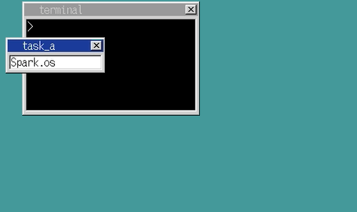

### day19 应用
- cat 命令

```c
// 文件信息
struct FILEINFO {
	unsigned char name[8], ext[3], type;
	char reserve[10];
	unsigned short time, date, clustno;
	unsigned int size;
};
```

- 通过二进制编辑器发现

| 文件名       | 数据  | clustno | 地址     |
|--------------|-------|---------|----------|
| HARIBOTE.SYS | 02 00 | 0x0002  | 0x004200 |
| IPL10.NAS    | 39 00 | 0x0039  | 0x00b000 |
| MAKE.BAT     | 3F 00 | 0x003f  | 0x00bc00 |

```c
clustno = 0x0002 -> 0x004200
clustno = 0x0039 -> 0x00b000
clustno = 0x003f -> 0x00bc00
// 六个簇
0x003f - 0x0039 = 6
0x00bc00 - 0x00b00 = 0xc00
// 六个扇区
0xc00 / 6 = 512
// 得出
address = clustno * 512 + 0x003e00
0x0002 * 512 + 0x004200 = 0x000400 + 0x003e00 = 0x004200
0x0039 * 512 + 0x00b000 = 0x007200 + 0x003e00 = 0x00b000
0x003f * 512 + 0x00bc00 = 0x007e00 + 0x003e00 = 0x00bc00
```

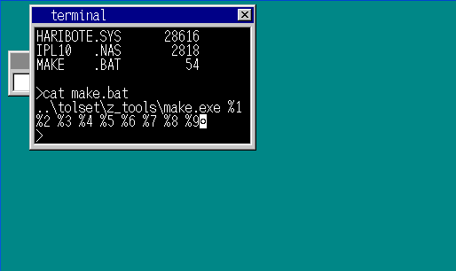

- cat 命令改进
	- 支持换行符

| 编码 | 字符   |
|------|--------|
| 0x09 | 制表符 |
| 0x0a | 换行符 |
| 0x0d | 回车符 |

- 忽略回车符
- 添加对 FAT 的支持
- 整理代码

- 第一个应用程序
	- HALT - 停止运行！
```nasm
[BITS 32]
fin:
	HLT
	JMP fin
```
- 将环境改为 Arch linux
- 安装运行 32 位程序的 gcc 库
```shell
sudo pacman -S lib32-gcc-libs, lib32-glibc
```

### day20 API
- 整理代码
	- `console.c -> terminal.c`
	- 分割函数功能

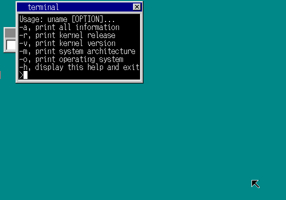

- 编写显示单个字符的 API
	- 如果直接调用`terminal.c`的`term_putchar()`需要手动查找其函数的地址，且需要在调用函数之前将参数推入栈中，非常麻烦
	- 通过用汇编`naskfunc.asm`编写一个推入栈的函数并且调用`term_putchar()`方法（封装），只需要知道`_asm_term_puchar`的地址就行了

```nasm
; naskfunc.asm
_asm_term_putchar:
		PUSH	1
		AND 	EAX,0xff	; 将 AH 和 EAX 的高位置 0，将 EAX 置为已存入字符编码的状态
		PUSH	EAX
		PUSH	DWORD [0x0fec]	; 读取内存并 PUSH 该值
		CALL	_term_putchar
		ADD 	ESP,12		; 将栈中的数据丢弃
		RETF

; halt.asm
[BITS 32]
	MOV 	AL,'A'
	CALL	2*8:0xBFC	; 应用程序对 API 执行 CALL 的时候，要加上操作系统的段号，使用 farcall 并将 naskfunc.nas 中 RET 改为 RETF
fin:
	HLT
	JMP fin
```

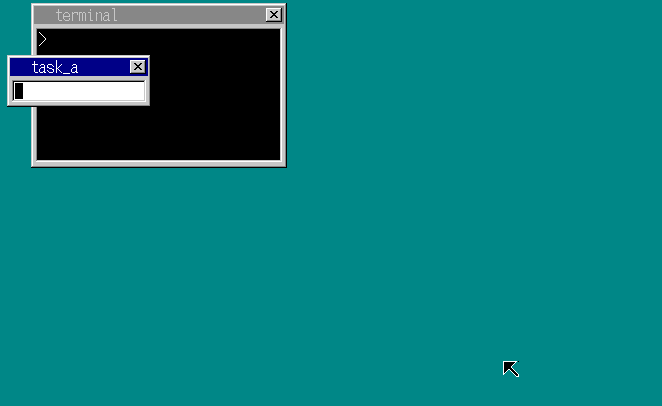

- 结束应用程序，在应用程序执行完成后返回操作系统的段`1003 * 8`
	- 编写`farcall()`函数，在执行`halt`完成后调用回到操作系统段
	```nasm
	; naskfunc.asm
	_farcall:	; void farcall(int eip, int cs);
		CALL FAR [ESP+4]	; eip, cs
		RET
	```
	- `terminal.c`
	```c
	// halt 应用
	void cmd_halt(struct TERM *term, int *fat)
	{
		struct MEMMAN *memman = (struct MEMMAN *) MEMMAN_ADDR;
		struct FILEINFO *finfo = file_search("halt.hrb", (struct FILEINFO *) (ADR_DISKIMG + 0x002600), 224);
		struct SEGMENT_DESCRIPTOR *gdt = (struct SEGMENT_DESCRIPTOR *) ADR_GDT;
		char *p;
		if (finfo != 0) {// 找到文件
			p = (char *) memman_alloc_4k(memman, finfo->size);
			file_loadfile(finfo->clustno, finfo->size, p, fat, (char *) (ADR_DISKIMG + 0x003e00));
			set_segmdesc(gdt + 1003, finfo->size - 1, (int) p, AR_CODE32_ER);
			farcall(0, 1003 * 8); // 这里！
			memman_free_4k(memman, (int) p, finfo->size);
		} else {// 没有找到文件
			putfonts8_str_sht(term->sht, 8, term->cur_y, COL8_FFFFFF, COL8_000000, "File not found");
			term_newline(term);
		}
	}
	```
	- 修改`halt.asm`返回为`RETF`
	- 因为修改了操作系统的代码，所以重新定位`_asm_term_putchar`的地址
		- `0x00000C01 : _asm_term_putchar`
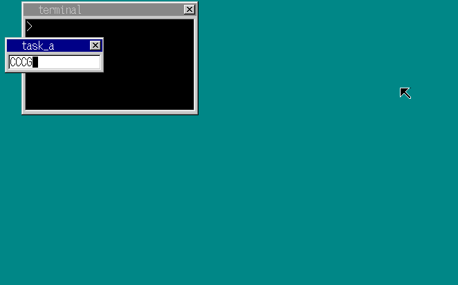
- 如果修改了操作系统的代码，就需要再次查看`_asm_term_putchar`的地址，太麻烦了，编写一个不随系统版本而改变的 API
	- 思路：在操作系统的中断记录表中注册此 API 在 0x40 号，就不需要调用地址了，直接进行中断处理`INT 0x40`
	- MOS-DOS 的 API 采用的也是这种 INT 方式
	- 但是在 INT 指令调用的时候会被视作中断来处理，用 RETF 是无法返回的，需要使用 IRETD 指令，需要改写`naskfunc.asm`
	- INT 中断执行的时候 CPU 会默认关闭所有中断（CLI 指令），在此不需要，只是调用此函数，API 处理电脑像死机了一样体验可不好
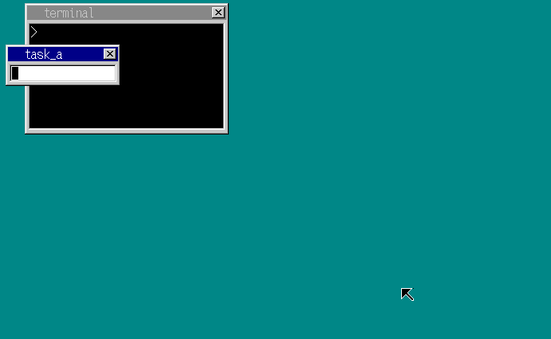

- 给应用程序命名
	- 思路：创建一个 cmd_app() 函数查找应用程序，如果找到了执行并返回 1，反之先加上扩展名 hrb 查找，若还是没找到，则返回 0

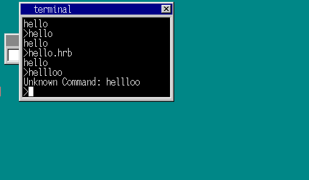

- 寄存器问题
	- 在修改 hello.asm 显示字符串的时候只显示第一个字符，因为在调用 0x40 中断的时候 ECX 寄存器的值发生了变化，应该是_term_putchar 改动了 ECX 的值
	- 加上 PUSHAD 和 POPAD 确保可以将全部寄存器的值还原，这样程序就能正常运行

- 创建显示字符串的 API
	- 思路：像单字符显示 API 一样
	- 借鉴 BIOS 的调用方式，在寄存器中存入功能号，使得 1 个 INT 可以选择调用不同的函数
	- BIOS 中，存放功能号的函数是 AH，最多只能存入 256 个 API 函数，改用 EDX 存放功能号，可以设置多达 42 亿个 API 函数

| 功能号 | 函数         | 寄存器                             |
|--------|--------------|------------------------------------|
| 1      | 显示单个字符 | AL = 字符编码                      |
| 2      | 显示字符串 0 | EBX = 字符串地址                   |
| 3      | 显示字符串 1 | EBX = 字符串地址，ECX = 字符串长度 |

```nasm
_asm_hrb_api:
	STI 	; 开启中断
	PUSHAD	; 用于保存寄存器值的 PUSH
	PUSHAD	; 用于向 hrb_api 传值的 PUSH
	CALL	_hrb_api
	ADD 	ESP,32
	POPAD
	IRETD
```
- 用 C 语言编写 API 处理程序
	- 用 switch 语句通过判断 EDX 跳转到对应 API
	- 通过_asm_hrb_api 得到相应寄存器的值，进行操作
- 将 INT 0x40 改为调用_asm_hrb_api
- 改写应用程序，定义需要调用的 API

```nasm
; hello.asm
[INSTRSET "i486p"]
[BITS 32]
	MOV		ECX,msg
	MOV		EDX,1
putloop:
	MOV		AL,[CS:ECX]
	CMP		AL,0
	JE		fin
	INT		0x40
	ADD		ECX,1
	JMP		putloop
fin:
	RETF
msg:
	DB		"hello",0

; hello2.asm 使用系统内置的字符串显示 API term_putstr()
[INSTRSET "i486p"]
[BITS 32]
	MOV		EDX,2
	MOV		ECX,msg
	INT		0x40
	RETF
msg:
	DB		"hello2",0
```
- 遇到了 BUG，hello.hrb 运行正常，但 hello2.hrb 出现异常，内存段的问题
	- 显示单个字符时，用 [CS:ECX] 的方式制定了 CS（代码段寄存器），因此可以成功读取 msg 的内容
	- 但是在显示字符串时，由于无法指定段地址，程序认为是 DS 而从完全错误的内存地址中读取了内容
	- 思路：cmd_app() 知道代码段的内存地址，将代码段地址设置为 0xfe8，然后在 hrb_api 的字符串显示中加上 0xfe8

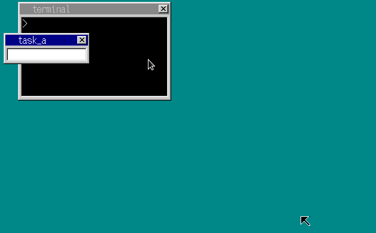

### day21 保护操作系统

- 用 C 语言编写应用程序
	- 思路：写一个 asm 的显示字符 API，通过 C 语言调用 API 达到显示字符的效果
	- a_nask.asm 和 naskfunc.asm 的显示字符函数一样
	- 通过修改 cmd_app() 函数的加载应用程序方法
		- 通过文件大小判断其是否为 C 语言应用，如果是，则修改内容在头地址加上执行主函数的汇编语句
```nasm
; e8 16 00 00 00 cb
CALL, 0x1b
RETF
```
- 修改对应的 Makefile 文件
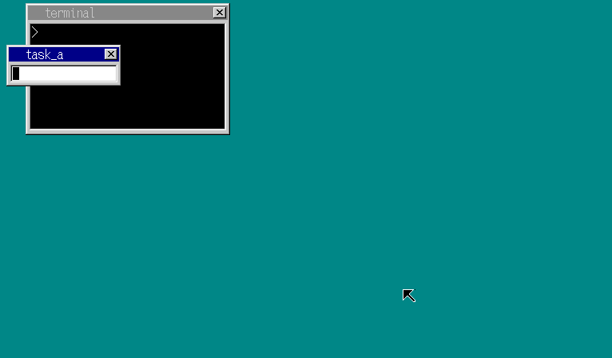

- 保护操作系统
	- 防止恶意应用操作，修复漏洞
	- 创建一个修改内存地址值的应用

```c
void HariMain()
{
	*((char *) 0x00102600) = 0;
}
```
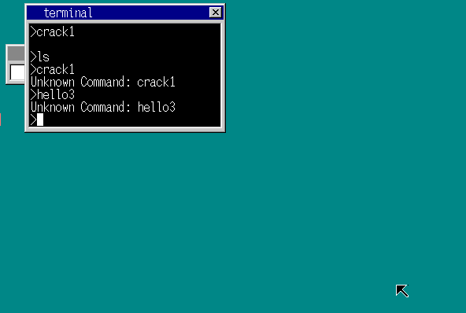

- 思路：创建内存等级；操作系统专用内存，应用专用内存
	- 应用专用内存空间先分配 64KB

| 用途             | 内存段           |
|------------------|------------------|
| 操作系统用代码段 | 2 * 8            |
| 操作系统用数据段 | 1 * 8            |
| 应用程序用代码段 | 1003 * 8         |
| 应用程序用数据段 | 1004 * 8         |
| TSS 任务段       | 3 * 8 ~ 1004 * 8 |

- 重写 naskfunc.asm 中断处理


- 阻止了恶意程序的破坏，但是没有终止此程序运行
- 对异常的支持
- 强制结束程序功能
	- 思路：在中断号 0x0d 中注册一个函数
	- 在 x86 架构规范中，当应用程序试图破坏操作系统，或者试图违背操作系统的设置时，就会自动产生 0x0d 中断，因此该中断也被称为“异常”

```nasm
_asm_inthandler0d:
		PUSH	ES
		PUSH	DS
		PUSHAD
		MOV		AX,SS
		CMP		AX,1*8
		JNE		.from_app
; 如果操作系统活动时产生的中断情况和之前差不多
		MOV		EAX,ESP
		PUSH	SS				; 保存中断时的 SS
		PUSH	EAX				; 保存中断时的 ESP
		MOV		AX,SS
		MOV		DS,AX
		MOV		ES,AX
		CALL	_inthandler0d

		ADD		ESP,8
		POPAD
		POP		DS
		POP		ES
		IRETD
.from_app:
; 当应用程序活动时发生中断
		MOV		EAX,1*8
		MOV		DS,AX			; 先仅将 DS 设定为操作系统专用
		MOV		ECX,[0xfe4]		; 操作系统的 ESP
		ADD		ECX,-8
		MOV		[ECX+4],SS		; 保存中断时的 SS
		MOV		[ECX],ESP		; 保存中断时的 ESP
		MOV		SS,AX
		MOV		ES,AX
		MOV		ESP,ECX
		STI
		CALL	_inthandler0d
		CLI
		CMP		EAX,0
		JNE		.kill
		POP		ECX
		POP		EAX
		MOV		SS,AX			; 将 SS 设回应用程序用
		MOV		ESP,ECX			; 将 ESP 设回应用程序用
		POPAD
		POP		DS
		POP		ES
		ADD		ESP,4			; INT 0x0d 需要这个值
		IRETD

.kill
; 强制结束应用程序
		MOV		EAX,1*8			; 操作系统用的 DS/SS
		MOV		ES,AX
		MOV		SS,AX
		MOV		DS,AX
		MOV		FS,AX
		MOV		GS,AX
		MOV		ESP,[0xfe4]		; 强制返回到 start_app 时的 ESP
		STI		; 切换完成后恢复中断请求
		POPAD	; 恢复事先保存好的寄存器值
		RET
```

- qemu 虚拟机实验的时候并没有抛出异常，在真机测试的时候能够抛出异常，qemu 的 BUG
- 操作系统会指定应用程序用的 DS，因此破坏行为会发生异常，那么如果忽略操作系统指定的 DS，而是用汇编语言将操作系统用的段地址存入 DS 的话，就又可以干坏事了

```nasm
[INSTRSET "i486p"]
[BITS 32]
		MOV 	EAX,1*8 	; OS 用的段号
		MOV 	DS,AX		; 将其存入 DS
		MOV 	BYTE [0x102600],0
		RETF
```
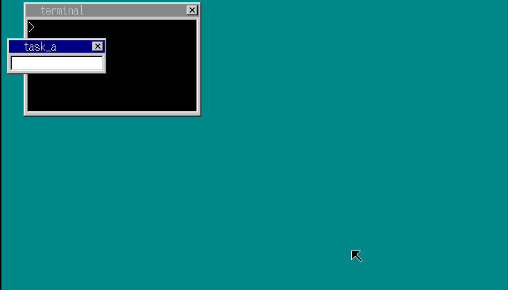

- 思路：想个办法使应用程序无法使用操作系统的段地址
	- 在段定义的地方，如果将访问权限加上 0x60 的话，就可以将段设置为应用程序用
	- 当 CS 地址中的段地址为应用程序用段地址时，CPU 会认为“当前正在运行应用程序”，如果这时存入操作系统的段地址就会产生异常
- 在 TSS 中注册操作系统用的段地址和 ESP
	- 使用此方法，启动应用程序的时候需要让“操作系统向应用程序用的段执行 far-CALL”，根据 x86 的规则，不允许操作系统 CALL 应用程序，强行 CALL 会产生异常，JMP 在 x86 中也是不行的
	- 使用 RETF 事先将地址 PUSH 到栈中，然后执行 RETF，这样就可以启动应用程序了
	- RETF 是当 far-CALL 调用后返回的指令，即使没有被 CALL 调用，也可以使用 RETF，其本质就是从栈中将地址 POP 出来，然后 JMP 到该地址
	- 用 RETF 代替 farjmp

```nasm
_start_app:		; void start_app(int eip, int cs, int esp, int ds, int *tss_esp0)
		PUSHAD		; 将 32 位寄存器的值全部保存起来
		MOV		EAX,[ESP+36]	; 应用程序用 EIP
		MOV		ECX,[ESP+40]	; 应用程序用 CS
		MOV		EDX,[ESP+44]	; 应用程序用 DS/SS
		MOV		EBX,[ESP+48]	; 应用程序用 ESP
		MOV		EBP,[ESP+52]	; tss.esp0 的地址
		MOV		[EBP],ESP		; 操作系统用 ESP
		MOV		[EBP+4],SS		; 保存操作系统用 SS
		MOV		ES,BX
		MOV		DS,BX
		MOV		FS,BX
		MOV		GS,BX
; 下面调整栈，以免用 RETF 跳转到应用程序
		OR		ECX,3			; 将应用程序用段号和 3 进行 OR 运算
		OR		EBX,3			; 将应用程序用段号和 3 进行 OR 运算
		PUSH	EBX				; 应用程序的 SS
		PUSH	EDX				; 应用程序的 ESP
		PUSH	ECX				; 应用程序的 CS
		PUSH	EAX				; 应用程序的 EIP
		RETF
```
- 其他相关函数进行对应的更改
- 让 0x40 号中断可以被应用程序调用，中断属性 +0x60

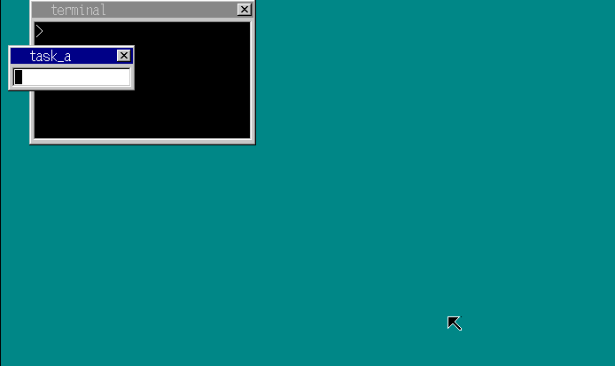

### day22 编写 C 语言应用程序
- 保护操作系统 5
	- 编写 crack3.asm
	```nasm
	[INSTRSET "i486p"]
	[BITS 32]
		CLI
	fin:
		HLT
		jmp fin
	```
		- 应用程序运行，操作系统会禁止应用程序使用 STI，CLI，HLT 这些指令
	- 编写 crack4.asm
	```nasm
	[INSTRSET "i486p"]
	[BITS 32]
			MOV		AL,0x34
			OUT		043,AL
			MOV		AL,0xff
			OUT		0x40,AL
			MOV		AL,0xff
			OUT		0x40,AL

	; 上述代码功能与下面代码相当
	; io_out8(PIT_CTRL, 0x34);
	; io_out8(PIT_CNT0, 0xff);
	; io_out8(PIT_CNT0, 0xff);

			MOV		EDX,4
			INT		0x40
	```
		- 以应用模式运行时，执行 IN 指令和 OUT 指令都会产生一般保护异常，通过修改 CPU 设置可以允许应用程序使用 IN，OUT 指令，但是会留下 BUG 遭到攻击
	- 编写 crack5.asm 通过 farjmp 执行操作系统的 io_cli()
	```nasm
	; bootpack.map
	0x00000ADA : _io_cli ; io_cli 所在的地址
	; crack5.asm
	[INSTRSET "i486p"]
	[BITS 32]
			CALL	2*8:0x00000ADA
			MOV		EDX,4
			INT		0x40
	```
		- CPU 规定除了设置好的地址以外，禁止应用程序 CALL 其他地址，因此应用程序要调用操作系统指令只能采用 INT 0x40 的方法

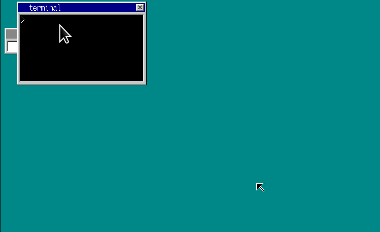

- 帮助发现 BUG
	- CPU 的异常处理功能，除了可以保护操作系统免遭应用程序的破坏，还可以帮我们在编写应用程序时发现 BUG
	- 编写 bug1.c
	```c
	void api_putchar();
	void api_end();

	void HariMain()
	{
		char a[100];
		a[10] = 'A';
		api_putchar(a[10]);
		a[102] = 'B';
		api_putchar(a[102]);
		a[123] = 'C';
		api_putchar(a[123]);
		api_end();
	}
	```
	- 运行后没有发生异常，本来该有异常
	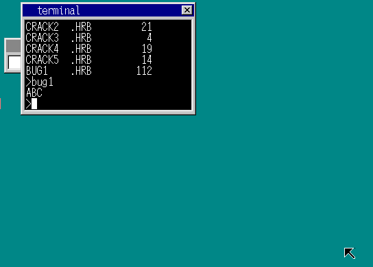
	- a 数组保存在栈中，应该产生了栈异常，需要一个函数来处理栈异常
	- 栈异常的中断号为 0x0c

| 中断号      | 说明                                            |
|-------------|-------------------------------------------------|
| 0x00 ~ 0x1f | 都是异常使用的中断                              |
| 0x00        | 除零异常                                        |
| 0x06        | 非法指令异常（执行一段 CPU 没有的机器语言指令） |
| 0x0c        | 栈异常                                          |
| 0x20~...    | IRQ 中断                                        |

- 通过调用段异常 0x0c 来抛出异常，inthandler0c
- 添加对异常信息的定位

| 栈元素  | 寄存器   | 解释                                         |
|---------|----------|----------------------------------------------|
| esp[0]  | EDI      | esp[0~7] 为_asm_inthandler 中 PUSHAD 的结果  |
| esp[1]  | ESI      |                                              |
| esp[2]  | EBP      |                                              |
| esp[4]  | EBX      |                                              |
| esp[5]  | EDX      |                                              |
| esp[6]  | ECX      |                                              |
| esp[7]  | EAX      |                                              |
| esp[8]  | DS       | esp[8~9] 为_asm_inthandler 中 PUSH 的结果    |
| esp[9]  | ES       |                                              |
| esp[10] | 错误编号 | 基本上是 0，显示出来也没什么意思             |
| esp[11] | EIP      |                                              |
| esp[12] | CS       | esp[10~15] 为异常产生时 CPU 自动 PUSH 的结果 |
| esp[13] | EFLAGS   |                                              |
| esp[14] | ESP      | 应用程序用 ESP                               |
| esp[15] | SS       | 应用程序用 SS                                |

- 用 C 语言显示字符串 1
```c
void api_putstr(char *s);
void api_end();

void HariMain()
{
	api_putstr("hello world");
	api_end();
}
```
	- 运行却没有显示任何字符
- 现将 cmd_app() 中的二进制文件执行的 JMP 0x1b 删除，因为无法执行 RETF 了
	- 在 hrb_api() 中加入应用程序显示字符串 ebx 寄存器数据显示功能
	- bim2hrb 认为"hello, world"存放在显示的这个地址当中
	- bim2hrb 生成的.hrb 文件其实是由两部分组成
		- 代码部分
		- 数据部分

- bim2hrb 生成的 .hrb 文件开头 36 字节存放的信息

| 地址（DWORD） | 信息                                     |
|---------------|------------------------------------------|
| 0x0000        | 请求操作系统为应用程序准备的数据段的大小 |
| 0x0004        | "Hari"（.hrb 文件的标记）                |
| 0x0008        | 数据段内预备空间的大小                   |
| 0x000c        | ESP 初始值 & 数据部分传送目的地址        |
| 0x0010        | hrb 文件内数据部分的大小                 |
| 0x0014        | hrb 文件内数据部分从哪里开始             |
| 0x0018        | 0xe9000000                               |
| 0x001c        | 应用程序运行入口地址 - 0x20              |
| 0x0020        | malloc 空间的起始地址                    |

- 根据可执行文件内容修改 terminal.c
```c
// 启动应用
int cmd_app(struct TERM *term, int *fat, char *cmdline)
{
	int segsiz, datsiz, esp, dathrb;
	struct MEMMAN *memman = (struct MEMMAN *) MEMMAN_ADDR;
	struct FILEINFO *finfo;
	struct SEGMENT_DESCRIPTOR *gdt = (struct SEGMENT_DESCRIPTOR *) ADR_GDT;
	char name[18], *p, *q;
	struct TASK *task = task_now();
	int i;
	for (i = 0; i < 13; i++) {// 根据命令生成文件名
		if (cmdline[i] <= ' ') break;
		name[i] = cmdline[i];
	}
	name[i] = 0;	// 将文件名后置为 0
	finfo = file_search(name, (struct FILEINFO *) (ADR_DISKIMG + 0x002600), 224);
	if (finfo == 0 && name[i - 1] != '.') {// 找不到文件通过加上文件后缀 '.hrb' 查找
		name[i]     = '.';
		name[i + 1] = 'H';
		name[i + 2] = 'R';
		name[i + 3] = 'B';
		name[i + 4] = 0;
		finfo = file_search(name, (struct FILEINFO *) (ADR_DISKIMG + 0x002600), 224);
	}
	if (finfo != 0) {// 找到文件
		p = (char *) memman_alloc_4k(memman, finfo->size);
		*((int *) 0xfe8) = (int) p;
		file_loadfile(finfo->clustno, finfo->size, p, fat, (char *) (ADR_DISKIMG + 0x003e00));
		// 如果文件大于 36 字节，那么就是 C 语言写的应用程序
		if (finfo->size >= 36 && strncmp(p + 4, "Hari", 4) == 0 && *p == 0x00) {
			segsiz = *((int *) (p + 0x0000));
			esp    = *((int *) (p + 0x000c));
			datsiz = *((int *) (p + 0x0010));
			dathrb = *((int *) (p + 0x0014));
			q = (char *) memman_alloc_4k(memman, segsiz);
			*((int *) 0xfe8) = (int) q;
			set_segmdesc(gdt + 1003, finfo->size - 1, (int) p, AR_CODE32_ER + 0x60);
			set_segmdesc(gdt + 1004, segsiz - 1,      (int) q, AR_DATA32_RW + 0x60);
			for (i = 0; i < datsiz; i++) q[esp + i] = p[dathrb + i];
			start_app(0x1b, 1003 * 8, esp, 1004 * 8, &(task->tss.esp0));
			memman_free_4k(memman, (int) q, segsiz);
		}
		else term_putstr(term, ".hrb file format error.");
		memman_free_4k(memman, (int) p, finfo->size);
		term_newline(term);
		return 1;
	}
	return 0;
}
```
	- 文件中找不到"Hari"则报错。
	- 数据段的大小根据.hrb 文件中指定的值进行分配
	- 将.hrb 文件中的数据部分先复制到数据段后再启动程序
- 根据 hello4.c 写了一个汇编语言的 hello5.asm

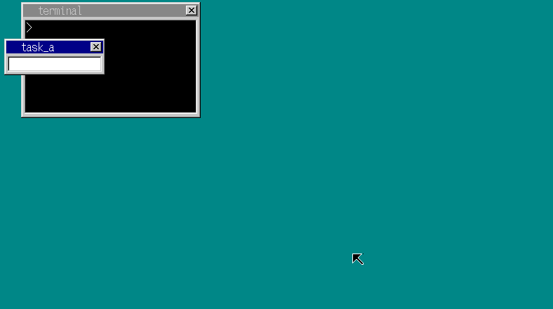

	一般操作系统会在可执行文件的头地址加上"Hari"这样的标记，Windows 的.exe 文件开头两个字节内容就是"MZ"，这里将可执行文件标记放在第四个字节开始
	因为如果其他不是可执行的文件可能带有相同的字符，被误认为是可执行文件，虽然可以通过扩展名区分，一般情况下不会出错
	但是如果扩展名可靠的话，就没必要加这样的标记了，就是因为扩展名有时候会出错，所以特地加了 4 个字节的标记，提高了安全性

- 显示窗口
	- 写一个显示窗口的 API

| 寄存器 | 存放内容                |
|--------|-------------------------|
| EDX    | 5                       |
| EBX    | 窗口缓冲区              |
| ESI    | 窗口 X 轴大小（窗口宽度） |
| EDI    | 窗口 Y 轴大小（窗口高度） |
| EAX    | 透明色                  |
| ECX    | 窗口名称                |

- 返回值：EAX= 用于操作窗口的句柄（用于刷新窗口等操作）
```nasm
; a_nask.asm
_api_openwin:	; int api_openwin(char *buf, int sxize, int yxize, int col_inv, char *title)
	PUSH	EDI
	PUSH	ESI
	PUSH	EBX
	MOV		EDX,5
	MOV		EBX,[ESP+16]	; buf
	MOV		ESI,[ESP+20]	; sxize
	MOV		EDI,[ESP+24]	; yxize
	MOV		EAX,[ESP+28]	; col_inv
	MOV		ECX,[ESP+32]	; title
	INT		0x40
	POP		EBX
	POP		ESI
	POP		EDI
	RET
```
- 编写 C 语言窗口应用程序
```nasm
int api_openwin(char *buf, int sxize, int yxize, int col_inv, char *title);
void api_end();

char buf[150 * 50];

void HariMain()
{
	int win;
	win = api_openwin(buf, 150, 50, -1, "Hello");
	api_end();
}
```
- 在 bootpack.c 中将层级管理器的地址存入 0x0fe4 地址然后在 api_hrb() 中调用进行窗口的初始化和层级的设置操作
```c
case 5:
	sht = sheet_alloc(shtctl);
	sheet_setbuf(sht, (unsigned char *) ebx + ds_base, esi, edi, eax);
	make_window8((unsigned char *) ebx + ds_base, esi, edi, (char *) ecx + ds_base, 0);
	sheet_slide(sht, 100, 50);
	sheet_updown(sht, 3);	// 背景层高度位于 task_a 之上
	reg[7] = (int) sht;
	break;
```
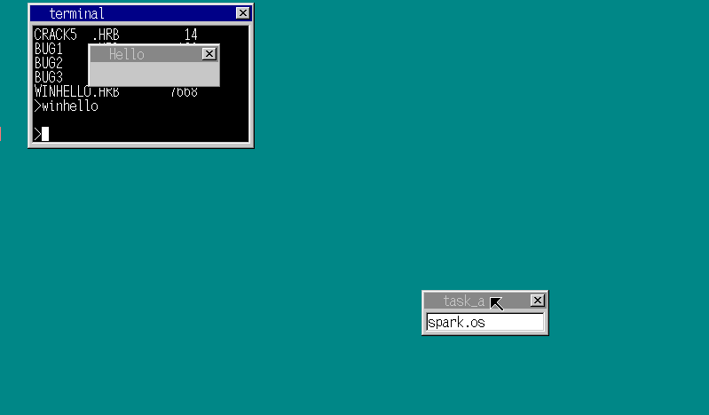

- 窗口显示字符和方块
- 显示字符 API

| 寄存器 | 存放内容        |
|--------|-----------------|
| EDX    | 6               |
| EBX    | 窗口句柄        |
| ESI    | 显示位置的 X 坐标 |
| EDI    | 显示位置的 Y 坐标 |
| EAX    | 色号            |
| ECX    | 字符串长度      |
| EBP    | 字符串          |
- 描绘方块 API

| 寄存器 | 存放内容 |
|--------|----------|
| EDX    | 7        |
| EBX    | 窗口句柄 |
| EAX    | X0       |
| ECX    | Y0       |
| ESI    | X1       |
| EDI    | Y1       |
| EBP    | 色号     |

- 操作系统修改
```c
case 6:
	sht = (struct SHEET *) ebx;
	putfonts8_str(sht->buf, sht->bxsize, esi, edi, eax, (char *) ebp + ds_base);
	sheet_refresh(sht, esi, edi, esi + ecx * 8, edi + 16);
	break;
case 7:
	sht = (struct SHEET *) ebx;
	boxfill8(sht->buf, sht->bxsize, ebp, eax, ecx, esi, edi);
	sheet_refresh(sht, eax, ecx, esi + 1, edi + 1);
	break;
```
- 根据 API 需求写出汇编函数

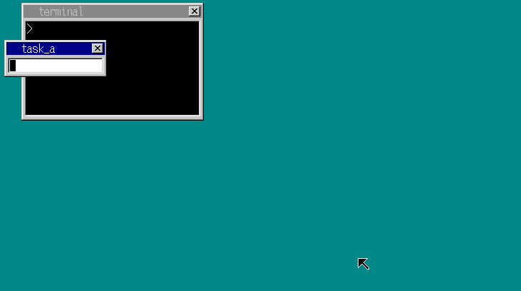

### day23 图形处理相关
- winhelo2.c 有 7.6KB 这么大，只是实现了一个窗口显示功能而已，用二进制编辑器查看，里面有很多的空地址，都是 char buf[150 * 50]
	- 相当于插入了 150*50=7500 个字节的"00"，和汇编语言的 RESB 7500 等效，去掉这句，可执行文件就可以小很多
- 编写一个 api_malloc() 函数
- memman 初始化

| 寄存器 | 存放内容                          |
|--------|-----------------------------------|
| EDX    | 8                                 |
| EBX    | memman 的地址                     |
| EAX    | memman 所管理的内存空间的起始地址 |
| ECX    | memman 所管理的内存空间的字节数   |
- malloc

| 寄存器 | 存放内容               |
|--------|------------------------|
| EDX    | 9                      |
| EBX    | memman 的地址          |
| ECX    | 需要请求的字节数       |
| EAX    | 分配到的内存空间的地址 |
- free

| 寄存器 | 存放内容               |
|--------|------------------------|
| EDX    | 10                     |
| EBX    | memman 的地址          |
| EAX    | 需要释放的内存空间地址 |
| ECX    | 需要释放的字节数       |

- 修改 terminal.c
- 修改后只占用 387 字节就可以创建一个窗口了

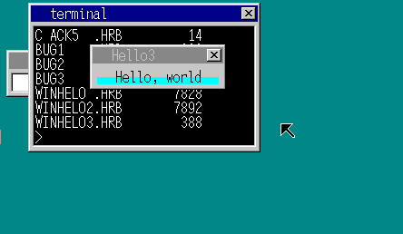

- 画点 API 函数

| 寄存器 | 存放内容          |
|--------|-------------------|
| EDX    | 11                |
| EBX    | 窗口句柄          |
| ESI    | 显示位置的 X 坐标 |
| EDI    | 显示位置的 Y 坐标 |
| EAX    | 色号              |

- 修改 termnial.c 的 hrb_api()
```c
case 11:
	sht = (struct SHEET *) ebx;
	sht->buf[sht->bxsize * edi + esi] = eax;
	sheet_refresh(sht, esi, edi, esi + 1, edi + 1);
	break;
```
- 创建 star1.c
```c
int api_openwin(char *buf, int xsiz, int ysiz, int col_inv, char *title);
void api_boxfilwin(int win, int x0, int y0, int x1, int y1, int col);
void api_initmalloc();
char *api_malloc(int size);
void api_point(int win, int x, int y, int col);
void api_end();

int rand(void);// 产生 0~32767 之间的随机数

void HariMain()
{
	char *buf;
	int win, i, x, y;
	api_initmalloc();
	buf = api_malloc(150 * 100);
	win = api_openwin(buf, 150, 100, -1, "stars");
	api_boxfilwin(win, 6, 26, 143, 93, 0);
	for (i = 0; i < 50; i++) {
		x = (rand() % 137) + 6;
		y = (rand() % 64) + 26;
		api_point(win, x, y, 3/*黄色*/);
	}
	api_end();
}
```
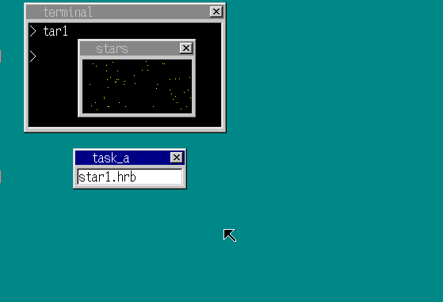

- 每次调用 api_point() 的时候，窗口都会刷新一次，太浪费性能，应该让画好之后，最后刷新一次窗口
- 在绘图命令中添加一个不自动刷新的选项，再编写一个只用来刷新窗口的 API
	- 思路：在计算 sht 的地方，将 ebx 和 0xfffffffe 做了一个 AND 运算，然后判断是否需要刷新，如果 ebx 最低一个比特为 0，则刷新窗口

| 寄存器 | 存放内容 |
|--------|----------|
| EDX    | 12       |
| EBX    | 窗口句柄 |
| EAX    | x0       |
| ECX    | y0       |
| ESI    | x1       |
| EDI    | y1       |

- 其他代码进行相应修改
- 通过 api_point() 实现描绘直线功能
```c
for (i = 0, i < len, i++)
{
	api_point(win, x, y, col);
	x += dx;
	y += dy;
}
```

| 寄存器 | 存放内容 |
|--------|----------|
| EDX    | 13       |
| EBX    | 窗口句柄 |
| EAX    | x0       |
| ECX    | y0       |
| ESI    | x1       |
| EDI    | y1       |
| EBP    | 色号     |


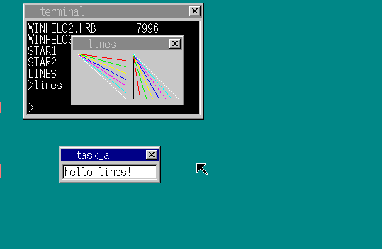

- 写一个关闭窗口的 API

| 寄存器 | 存放内容 |
|--------|----------|
| EDX    | 14       |
| EBX    | 窗口句柄 |

- 写一个键盘输入 API
	- 在按下终止键之后再结束运行

| 寄存器 | 存放内容                      |
|--------|-------------------------------|
| EDX    | 15                            |
| EAX    | 0 没有键盘输入时返回 -1，不休眠 |
|        | 1 休眠直到发生键盘输入 1        |
| EAX    | 输入字符编码                  |

- 程序收到回车键后关闭窗口

```c
int api_openwin(char *buf, int xsiz, int ysiz, int col_inv, char *title);
void api_boxfilwin(int win, int x0, int y0, int x1, int y1, int col);
void api_initmalloc();
char *api_malloc(int size);
void api_point(int win, int x, int y, int col);
void api_linewin(int win, int x0, int y0, int x1, int y1, int col);
void api_refreshwin(int win, int x0, int y0, int x1, int y1);
int api_getkey(int mode);
void api_closewin(int win);
void api_end();

void HariMain()
{
	char *buf;
	int win ,i;
	api_initmalloc();
	buf = api_malloc(160 * 100);
	win = api_openwin(buf, 160, 100, -1, "lines");
	for (i = 0; i < 8; i++) {
		api_linewin(win + 1, 8, 26, 77, i * 9 + 26, i);
		api_linewin(win + 1, 88, 26, i * 9 + 88, 89, i);
	}
	api_refreshwin(win, 6, 26, 154, 90);

	for (;;) {
		if (api_getkey(1) == 0x0a) {
			break;
		}
	}
	api_closewin(win);
	api_end();
}
```


- 用键盘输入来消遣一下
	- 编写了一个小人走路游戏，walk.hrb
- 强制结束并关闭窗口
	- 在运行 walk.hrb 和 lines.hrb 时，如果不按回车键结束，而是按 Ctrl+c 的话，窗口会残留在画面上，也不奇怪，因为没有做处理
	- 思路：在 struct SHEET 中添加一个用来存放 task 的成员，当应用程序结束时，查询所有图层，如果图层的 task 为要结束的应用程序任务，则关闭该图层
	- 这样不仅起作用于强制结束任务时，就算应用程序没有写调用关闭窗口的代码，系统也会关闭他，就可以不用调关闭窗口的 API 了


### day24 窗口操作
- 窗口切换
- 窗口移动
- 鼠标关闭窗口
- 将输入切换到应用程序窗口
	- 把 key_to 改为 key_win（输入指向的程序窗口）

	在 SHEET 结构体中的 TASK 成员判断数据发送对象的 FIFO
	因此在 sht_term->task 中也加入了 TASK 结构的地址，这样的话就无法判断窗口是不是由应用程序生成的
	需要通过 SHEET 结构中的 flags 成员进行判断（以 0x10 比特位进行区分）此外，只有命令行窗口需要控制光标的 ON/OFF
	应用程序窗口不需要，这一区别也是通过 flags 来进行判断的（0x20 比特位进行区分）
- 鼠标切换输入窗口

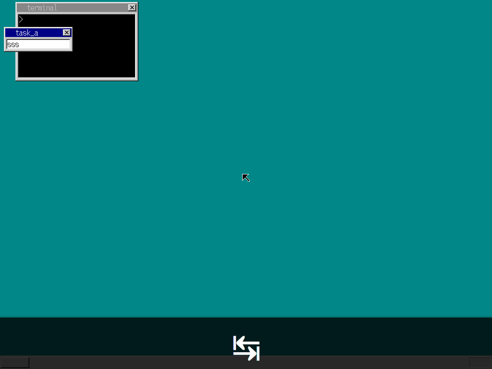

- 定时器 API
	- 让应用程序也能使用定时器进行一系列操作

- 获取定时器 timer_alloc

| 寄存器 | 存放内容   |
|--------|------------|
| EDX    | 16         |
| EAX    | 定时器句柄 |

- 设置定时器的发送数据 timer_init

| 寄存器 | 存放内容   |
|--------|------------|
| EDX    | 17         |
| EBX    | 定时器句柄 |
| EAX    | 数据       |

- 定时器时间设定 timer_settime

| 寄存器 | 存放内容   |
|--------|------------|
| EDX    | 18         |
| EBX    | 定时器句柄 |
| EAX    | 时间       |

- 释放定时器 timer_free

| 寄存器 | 存放内容   |
|--------|------------|
| EDX    | 19         |
| EBX    | 定时器句柄 |

- 在 a_nask.asm 中写对应 API
	- 创建一个计时的应用 noodle.c

```c
#include <stdio.h>

int api_openwin(char *buf, int xsiz, int ysiz, int col_inv, char *title);
void api_boxfilwin(int win, int x0, int y0, int x1, int y1, int col);
void api_initmalloc();
char *api_malloc(int size);
void api_point(int win, int x, int y, int col);
void api_refreshwin(int win, int x0, int y0, int x1, int y1);
void api_putstrwin(int win, int x, int y, int col, int len, char *str);
int api_getkey(int mode);
int api_alloctimer();
void api_inittimer(int timer, int data);
void api_settimer(int timer, int time);
void api_closewin(int win);
void api_end();

void HariMain()
{
	char *buf, s[12] = {0};
	int win, timer, sec = 0, min = 0, hour = 0;
	api_initmalloc();
	buf = api_malloc(150 * 50);
	win = api_openwin(buf, 150, 50, -1, "Noodle");
	timer = api_alloctimer();
	api_inittimer(timer, 128);
	for (;;) {
		sprintf(s, "%5d:%02d:%02d", hour, min, sec);
		api_boxfilwin(win, 28, 27, 115, 41, 7);
		api_putstrwin(win, 28, 27, 0, 11, s);

		api_settimer(timer, 100);
		if (api_getkey(1) != 128) break;
		sec++;
		if (sec == 60) {
			sec = 0;
			min++;
			if (min == 60) {
				min = 0;
				hour++;
			}
		}
	}
	api_end();
}
```
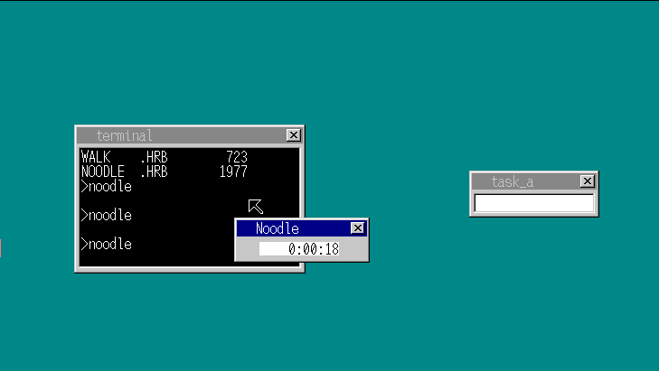

- 当定时器结束后会发送超时的数据，如果这时应用程序已经结束了，定时器的数据就会被发送到终端，终端就会显示一个字符
- 编写一个取消定时器的函数，达到效果后结束定时器

```c
int timer_cancel(struct TIMER *timer)
{
	int e;
	struct TIMER *t;
	e = io_load_eflags();
	io_cli();// 设置过程中禁止改变定时器状态
	if (timer->flags == TIMER_FLAGS_ACTING) {// 是否需要取消
		// 第一个定时器的处理
		if (timer == timerctl.t0) {
			// 如果是哨兵就跳过
			t = timer->next;
			timerctl.t0 = t;
			timerctl.next = t->timeout;
		} else {
			// 非第一个定时器的取消处理
			// 找到 timer 前一个定时器
			t = timerctl.t0;
			for (;;) {
				if (t->next == timer) break;
				t = t->next;
			}
			// 将之前"timer 的下一个"指向"tiemr 的下一个"
			t->next = timer->next;
		}
		timer->flags = TIMER_FLAGS_ALLOC;
		io_store_eflags(e);
		return 1; // 取消处理成功
	}
	io_store_eflags(e);
	return 0;// 不需要取消处理
}
```
- 在定时器结构体里添加 flags2 是否为应用程序定时器的标志
	- 其他关联代码进行相应修改
- 在 hrb_api 中对请求定时器的应用将定时器的应用标志置为 1
```c
reg[7] = (int) timer_alloc();
((struct TIMER *) reg[7])->flags2 = 1;	// 允许自动取消
```
- 在应用程序结束后自动结束不需要的定时器

```c
void timer_cancelall(struct FIFO32 *fifo)
{
	int e, i;
	struct TIMER *t;
	e = io_load_eflags();
	io_cli();
	for (i = 0; i < MAX_TIMER; i++) {
		t = &timerctl.timers0[i];
		// 当前定时器是否正在已经分配，是否为应用程序的定时器，其缓冲区是否是目标定时器
		if (t->flags != 0 && t->flags2 != 0 && t->fifo == fifo) {
			timer_cancel(t);
			timer_free(t);
		}
	}
	io_store_eflags(e);
}
```

### day25 增加命令行窗口
- 蜂鸣器发声
	- 蜂鸣器发声和定时器一样，都是由 PIT 来控制的，而 PIT 位于芯片组中，因此所有型号的电脑都能使用它
- 蜂鸣器发声的控制

| 寄存器   | 存放内容          | 代码          |
|----------|-------------------|---------------|
| 高音操作 | -                 | -             |
| AL       | 0xb6              | OUT(0x43, AL) |
| AL       | 设定值的低位 8bit | OUT(0x42,AL)  |
| AL       | 设定值的高位 8bit | OUT(0x42,AL)  |

	设定值为 0 的时候当做 65536 来处理，发声的音高为时钟除以设定值
	也就是说设定值为 1000 时发出 1.19318KHz 的声音
	设定值为 10000 时相当于 119.318Hz，因此设定在 2712 即可发出约 440Hz 的声音
	440Hz 为中央 C 之上的 A 音，即国际标准音。

- 蜂鸣器 ON/OFF
	- 使用 I/O 端口 0x61 控制
	- ON: IN(AL, 0x61); AL |= 0x03; AL &= 0x0f; OUT(0x61,AL);
	- OFF: IN(AL, 0x61); AL &= 0xd; OUT(0x61,AL);
	- PIT 时钟的频率恒定为 1.19318MHz

- 蜂鸣器发声 API

| 寄存器 | 存放内容       |
|--------|----------------|
| EDX    | 20             |
| DAX    | 声音频率 (mHz) |

```c
if (eax == 0) {
	i = io_in8(0x61);
	io_out8(0x61, i & 0x0d);
} else {
	i = 1193180000 / eax;
	io_out8(0x43, 0xb6);

	io_out8(0x42, i & 0xff);
	io_out8(0x42, i >> 8);
	i = io_in8(0x61);
	io_out8(0x61, (i | 0x03) & 0x0f);
}
```
- 增加更多的颜色 1
- 增加更多的颜色 2
	- 通过像素混合的方式显示更多的颜色


- 删除了 task_a
- 任务结构体添加了是否是终端的标志
- 不同终端用不同的内存段
- 多应用开启

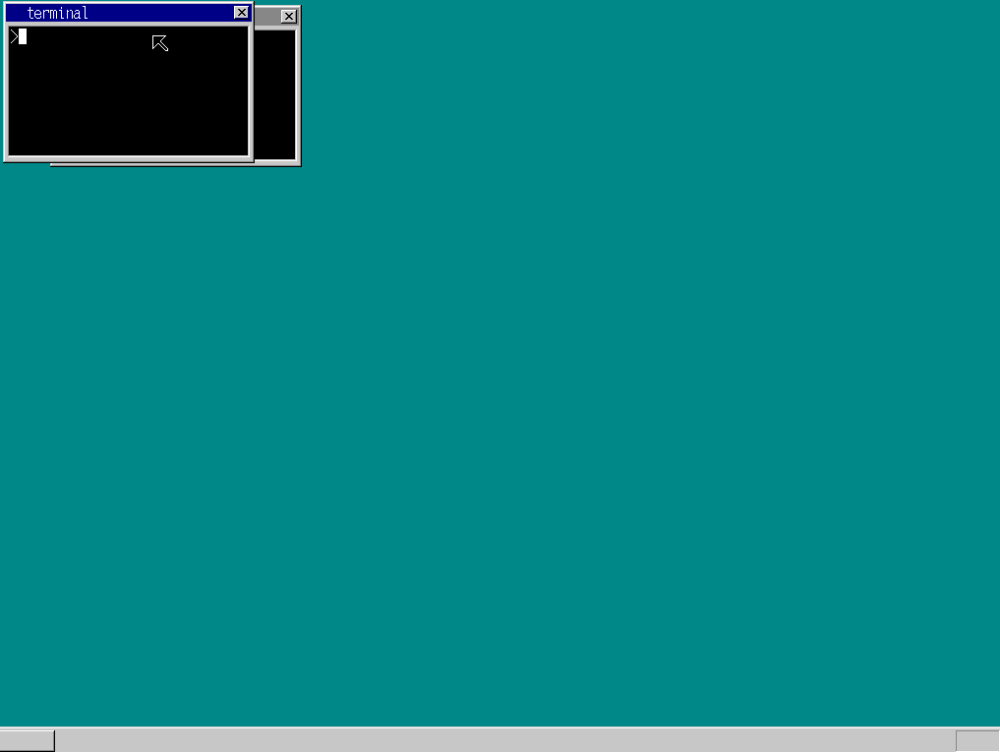

### day26 为窗口移动提速
- 提高窗口移动速度
	- 思路：在 sheet_refreshmap 中，对窗口的每一个像素点判断是否为透明色然后刷新太慢，改为两个方法，刷新非透明窗口的和透明窗口的
```c
if (sht->col_inv == -1) {
	// 无透明图层专用的高速版本
	for (by = by0; by < by1; by++) {
		vy = sht->vy0 + by;
		for (bx = bx0; bx < bx1; bx++) {
			vx = sht->vx0 + bx;
			vmap[vy * ctl->xsize + vx] = sid;
		}
	}
} else {
	// 有透明图层用的普通版
	for (by = by0; by < by1; by++) {
		vy = sht->vy0 + by;
		for (bx = bx0; bx < bx1; bx++) {
			vx = sht->vx0 + bx;
			if (buf[by * sht->bxsize + bx] != sht->col_inv) vmap[vy * ctl->xsize + vx] = sid;
		}
	}
}
```
- 再次进行窗口移速加快
```c
vmap[vy * ctl->xsize + vx] = sid;
// 在内存中的某个地址写入 sid 的值
// 位于 for 循环中，而且这个地址的后面之后的地址也要写入 sid
```
- 这样就有更好的方法
	- 在汇编语言中，如果用 16 位寄存器代替 8 位寄存器来执行 MOV 指令的话，相邻的地址中也会同时写入数据
	- 如果用 32 位寄存器，一条指令就可以同时向 4 个相邻的地址写入值
	- 只要指定地址是 4 的整数倍，执行速度就和 1 个字节是相同的，应该能提升到原来的 4 倍

- 当 FIFO 缓冲区中没有数据的时候再进行画面刷新，用 new_wx, new_wy 将值保存起来
- 启动时只打开一个命令行窗口
	- 按住 shift+alt+enter 打开命令行窗口

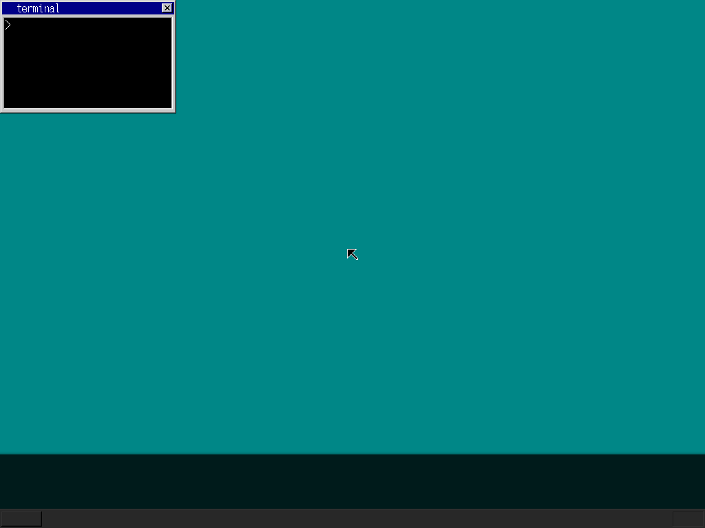

- 增加更多的命令行窗口
	- 删除 sht_term，直接向 key_win 赋值
```c
keywin_off(key_win);
sheet_slide(key_win, 32, 4);
key_win = open_terminal(shtctl, memtotal);
sheet_updown(key_win, shtctl->top);
// 自动将焦点切换到新打开的命令行窗口
keywin_on(key_win);
```
- 关闭终端
	- 编写 cmd_exit() 命令，在终端输入 cmd_ext() 的时候将终端的窗口和缓冲区保存在固定的内存地址
	- 将内存释放掉，对操作系统的缓冲区发送数据，为 768 + 当前终端的窗口句柄
	- 操作系统读取缓冲区的值，释放终端的缓冲区，如果没有任何窗口了，就将聚焦设置到哨兵 task_a 上
	- alt + shift + c 关闭终端
	- 添加了 x 鼠标关闭终端

- exec 执行应用

- 修复了中断切换时白色光标停留在未激活终端的现象
- 添加了无终端启动应用程序
- 编写了无终端启动的方法
	- 将终端启动中的窗口与终端任务分离为两个方法，并且无终端启动时终端的定时器、字符等都不会启动

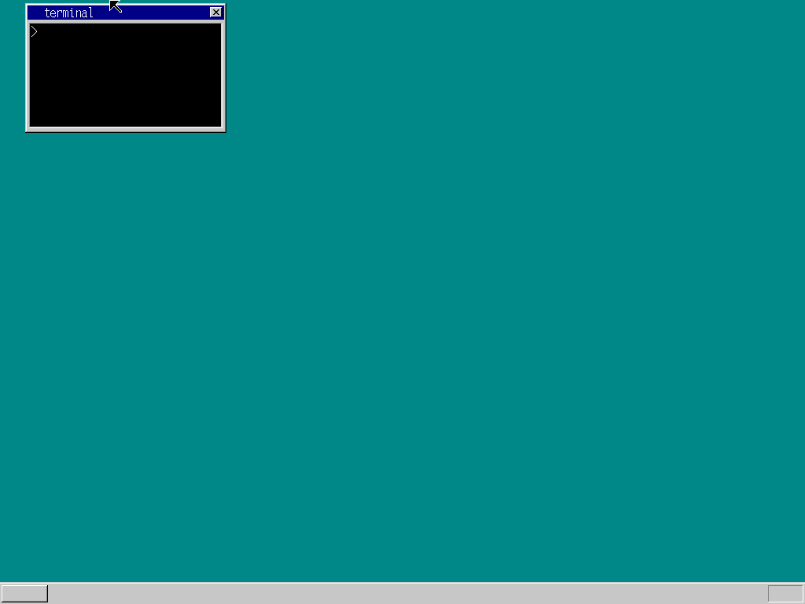

### day27 LDT 与库
- 修复 bug
	- 无终端启动应用程序后无法关闭应用，无论是强制关闭还是输入程序指定的按键
	- 因为开启应用程序后逻辑是要没有窗口的终端任务进入休眠，这样就无法接收按键指令，也无法执行结束任务的指令，所以就需要唤醒任务
	- 之前强制结束没有问题是因为终端会 0.5s 触发中断，对终端的 fifo 缓冲区发送数据就会唤醒终端，并且会有最大 0.5s 的强制结束延迟
- 应用程序运行时关闭命令行窗口
- 应用程序启动后可以关闭终端
	- 将终端的层级先隐藏，然后释放
	- 通过 hrb_api 发送指令到操作系统，释放关闭终端的层级

- 保护应用程序
	- 编写破坏应用程序的病毒
	- 因为应用程序之间可以互相访问彼此的内存段，并做出修改，所以可以破坏
```nasm
[FORMAT "WCOFF"]
[INSTRSET "i486p"]
[BITS 32]
[FILE "crack7.asm"]
		GLOBAL	_HariMain
[SECTION .text]

_HariMain:
		MOV		AX,1005*8
		MOV		DS,AX
		CMP		DWORD [DS:0x0004],'Hari'

		JNE		fin					; 不是应用程序，因此不执行任何操作下

		MOV		ECX,[DS:0x0000]		; 读取该应用程序数据段的大小
		MOV		AX,2005*8
		MOV		DS,AX

crackloop:							; 整个用 123 填充
		ADD		ECX,-1
		MOV		BYTE [DS:ECX],123
		CMP		ECX,0
		JNE		crackloop

fin:								; 结束
		MOV		EDX,4
		INT		0x40
```

| 段号 | 主人                             |
|------|----------------------------------|
| 1003 | task_a 用                        |
| 1004 | idle 用                          |
| 1005 | 第一个命令行窗口的应用程序代码段 |
| 1006 | 第二个命令行窗口的应用程序代码段 |

- 应用程序之间不能互相访问段，但是 CPU 没有设置，需要自己编写
	- 通过 LDT（local segment descriptor label）的设置，让其他任务无法使用该 LDT，就不用担心它们来搞破坏了
	- 容量和 GDT 一样，都是 64KB，容纳 8192 个段
	- 通过 GDTR 寄存器将 GDT 的内存地址告知 CPU，LDT 的内存地址则是通过在 GDT 中创建 LDT 段来告知 CPU
	- 在 GDT 中可以设置多个 LDT（不能同时使用两个以上的 LDT），和 TSS 非常相似

- 在 start_app 指定了段号是 4(=0x8+4) 和 12(=1x8+4)，乘 8 的部分和 GDT 是一样的，但不一样的是还加上了 4，这是代表该段号不是 GDT 的段号，而是 LDT 内的段号
	- 每个任务都有自己专用的 LDT 段号

```c
start_app(0x1b, 0 * 8 + 4, esp, 1 * 8 + 4, &(task->tss.esp0));
```
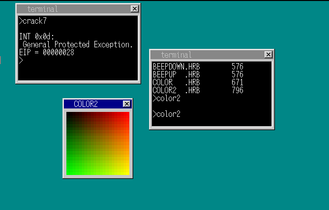

- 优化应用程序大小
	- 将 a_nask.obj 的方法拆开成相互独立的文件，但是这样太麻烦
	- 创建库

- 整理了 Make 环境

### day28 文件操作与文字显示
- 写一个输出质数的应用程序，当输出的质数在 10000 以内的时候会因为栈空间不足而运行异常，所以需要写一个自动分配空间的功能
```c
#include <stdio.h>
#include "../apilib.h"

#define MAX 10000

void HariMain()
{
	char *flag, s[8];
	int i, j;
	api_initmalloc();
	flag = api_malloc(MAX);
	for (i = 2; i < MAX; i++) {
		if (flag[i] == 0) {
			sprintf(s, "%d ", i);
			api_putstr(s);
			for (j = i * 2; j < MAX; j += i) {
				flag[j] = 1;
			}
		}
	}
	api_end();
}
```
```nasm
; __alloca 会在下述情况下被 c 语言调用（采用 near-CALL 的方式）
; 要执行的操作从栈中分配 EAX 个字节的内存空间（ESP -= EAX; ）
; 要遵守的规则不能改变 ECX、EDX、EBX、EBP、ESI、EDI 的值（可以临时改变，但要使用 PUSH 或 POP 复原）
; 错误的 alloca 示例
SUB    ESP,EAX
RET
; 这个程序是无法运行的，因为 RET 返回的地址保存在了 ESP 中，而 ESP 的值在这里被改变了
; 于是读取了错误的返回地址
; 错误的 alloca 示例 2
SUB    ESP,EAX
JMP    DWORD [ESP+EAX]    ; 代替 RET
; 这个貌似不错，JMP 的目标地址从 [ESP] 变成了 [ESP+EAX]，而 ESP+EAX 的值正好是减法运算之前的 ESP 值
; 不过这样还是有问题，“RET” 指令相当于 “POP EIP”，而 “POP EIP” 实际上又相当于下面两条指令
MOV    EIP,[ESP]    ; 没有这个指令，用 JMP [ESP] 代替
ADD    ESP,4
; 也就是说，刚刚忘记给 ESP 加上 4，因此 ESP 的值就有了误差
; 错误的 alloca 示例 3
SUB    ESP,EAX
JMP    DWORD [ESP+EAX]
ADD    ESP,4
; 这个程序的问题在于 ADD 指令的位置，将 ADD 指令放在了 JMP 指令的后面，所以是不可能被执行的
; 基本正确的 alloca 示例
SUB    ESP,EAX
ADD    ESP,4
JMP    DWORD [ESP+EAX-4]    ; 代替 RET
; 最后的版本
ADD    EAX,-4
SUB    ESP,EAX
JMP    DWORD [ESP+EAX]    ; 代替 RET
```

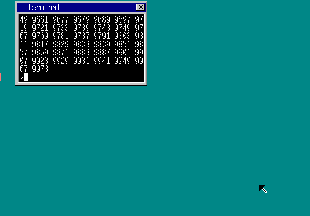

- 将 winhelo 程序也在栈中分配空间

```c
#include "../apilib.h"

void HariMain()
{
	int win;
	char buf[150 * 50];
	win = api_openwin(buf, 150, 50, -1, "Hello");
	for (;;) {
		if (api_getkey(1) == 0x1c) break;
	}
	api_end();
}
// Makefile
APP    = winhelo
STACK  = 8k
MALLOC = 0k

include ../app_make.txt
```
- winhelo 程序从 7764 字节变为 174 字节
- 同时也修改 winhelo2

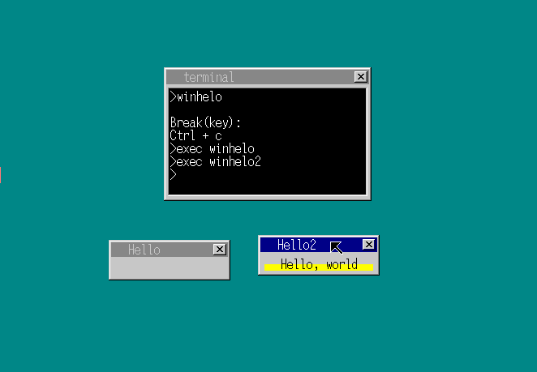

- 文件操作 API
- API 功能
	- 打开 open
		- 文件名
		- 返回文件句柄
	- 定位 seek
		- 定位检索指定文件所在的扇区
	- 读取 read
		- 指定读取的数据长度以及内存地址
		- 文件被传入至内存
	- 写入 write
		- 指定写入的数据长度以及内存地址
		- 内存被传入至文件
	- 关闭 close

- 打开文件

| 寄存器 | 内容                           |
|--------|--------------------------------|
| EDX    | 21                             |
| EBX    | 文件名                         |
| EAX    | 文件句柄（为 0 时表示打开失败） |
- 关闭文件

| 寄存器 | 内容     |
|--------|----------|
| EDX    | 22       |
| EAX    | 文件句柄 |
- 文件定位

| 寄存器 | 内容                     |
|--------|--------------------------|
| EDX    | 23                       |
| EAX    | 文件句柄                 |
| ECX    | 定位模式                 |
| =0     | 定位的起点为文件开头     |
| =1     | 定位的起点为当前访问位置 |
| =2     | 定位的起点为文件末尾     |
| EBX    | 定位偏移量               |
- 获取文件大小

| 寄存器 | 内容                               |
|--------|------------------------------------|
| EDX    | 24                                 |
| EAX    | 文件句柄                           |
| ECX    | 文件大小获取模式                   |
| =0     | 普通文件大小                       |
| =1     | 当前读取位置从文件开头起算的偏移量 |
| =2     | 当前读取位置从文件末尾起算的偏移量 |
| EAX    | 文件大小（操作系统返回）           |
- 文件读取

| 寄存器 | 内容                                 |
|--------|--------------------------------------|
| EDX    | 25                                   |
| EAX    | 文件句柄                             |
| EBX    | 缓冲区地址                           |
| ECX    | 最大读取字节数                       |
| EAX    | 本次读取到的字节数（由操作系统返回） |

- 将 cat 命令转换为应用程序，而不是内置命令
- 由于 cat.hrb 还只能显示 ipl10.asm 这个文件，需要实现能指定文件名的功能，否则它就无法替代 cat 命令
	- 需要获取后面的文件名，编写一个获取命令行的 API

## TODO
### 终端
| 按键        | 功能         |
|-------------|--------------|
| TAB         | 补全         |
| BACKSPACE   | ~~退格~~     |
| 上下箭头    | 历史命令     |
| PageUp/Down | 终端滚动     |
| 命令        | ~~打开应用~~ |
| C-c         | ~~结束应用~~ |
| C-l         | ~~清屏~~     |
| C-p         | 上一个命令   |
| C-k         | 下一个命令   |
| &           | 后台运行程序 |
| pkill       | 杀死某个进程 |
| exec        | ~~执行程序~~ |
| exit        | ~~退出终端~~ |

#### vi mode
1. 支持 ESC 进入 NORMAL 模式
##### INSERT 模式
1. 默认 INSERT 模式
##### NORMAL 模式
1. 连续的字母跳转
2. v 切换 VISUAL
##### REPLACE 模式
##### VISUAL 模式
##### V-BLOCK 模式
##### V-LINE 模式

### 操作系统

~~1. 支持组合快捷键~~
2. time 软件，计算程序运行时间
