<!-- vim-markdown-toc GFM -->

* [30days make a os](#30days-make-a-os)
	* [Progress](#progress)
		* [day05 包括之前的处理](#day05-包括之前的处理)
		* [day06 分割编译与中断处理](#day06-分割编译与中断处理)
		* [day07 FIFO 与鼠标控制](#day07-fifo-与鼠标控制)
		* [day08 鼠标控制与 32 位模式切换](#day08-鼠标控制与-32-位模式切换)
		* [day09 内存管理](#day09-内存管理)
		* [day10 叠加处理](#day10-叠加处理)
		* [day11 制作窗口](#day11-制作窗口)
		* [day12 定时器](#day12-定时器)
		* [day13 继续优化定时器](#day13-继续优化定时器)
		* [day14 提高分辨率和键盘输入](#day14-提高分辨率和键盘输入)
		* [day15 多任务并发](#day15-多任务并发)
		* [day16 继续多任务](#day16-继续多任务)
		* [day17 实现命令行窗口](#day17-实现命令行窗口)
		* [day18 终端命令](#day18-终端命令)

<!-- vim-markdown-toc -->

# 30days make a os
- just note my daily practice
- day01 ~ day04 were missing because this repo was created at the very 5 day

## Progress
### day05 包括之前的处理
### day06 分割编译与中断处理
- 将 bootpack.c 进行分割，更改 makefile 编译
- PIC 分为主 PIC 和从 PIC，主 PIC 的第 2 个 IO 引脚连接从 PIC，对其注册后接收从 PIC 的中断信号
- 初始化 PIC，处理鼠标和键盘中断，接收电气中断但不处理
- 键盘中断处理顺利，鼠标中断处理有问题，暂时没找到原因
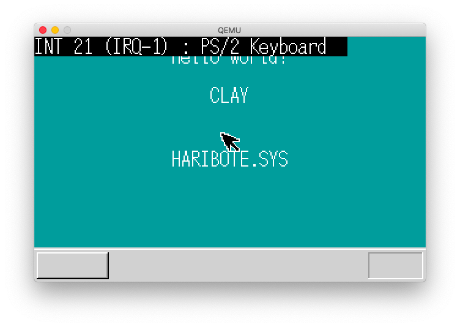
### day07 FIFO 与鼠标控制
- 整理文件
- 创建 FIFO 缓冲区，优化键盘数据和鼠标数据接收速度
- 通过资料得出鼠标的处理电路集成在键盘处理电路上，向键盘电路发送指令注册鼠标处理电路然后才能接收中断
- 鼠标一次性发送 3 字节数据，需要比键盘更大的缓冲区
- 对 FIFO 缓冲区进行优化，采用循环链表，不需要进行移位操作，提高缓冲区处理速度和性能
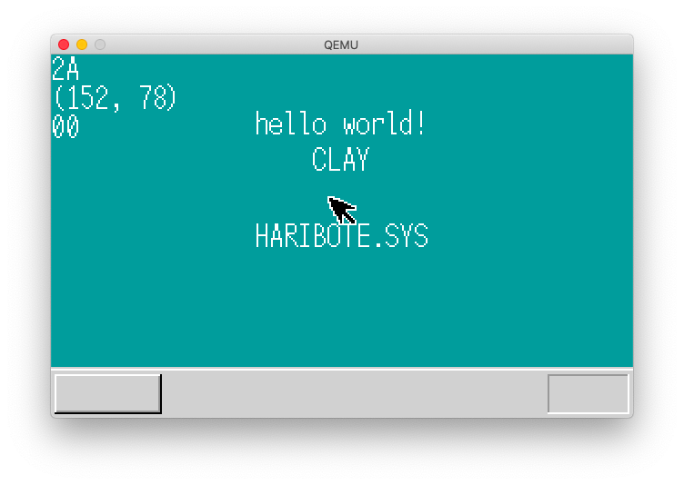
### day08 鼠标控制与 32 位模式切换
- 整理文件
- 对鼠标发送的 3 字节数据进行处理，采用`switch`提高处理速度，在`for(;;)`里进行不断的接收数据
- 鼠标的渲染会将其他画面的渲染覆盖，思考处理方式
- haribote.sys - 9.21KB
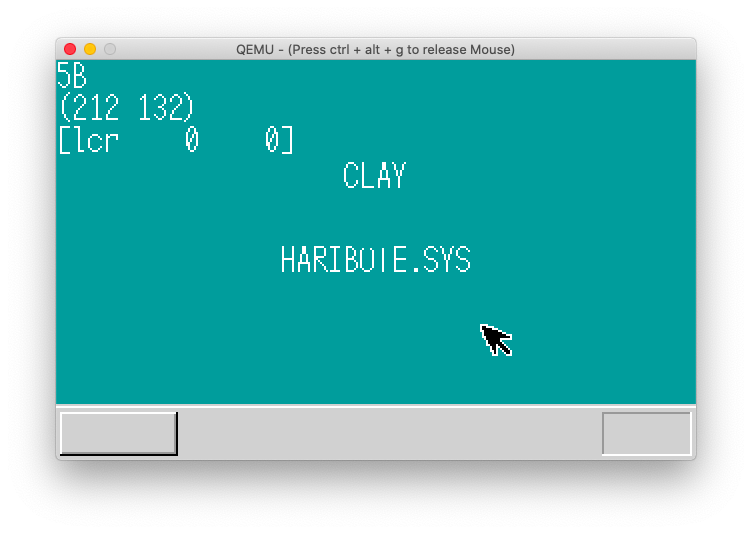
### day09 内存管理
- 整理文件
- 通过对内存每字节写入数据进行容量检查
- 单个字节写入太慢，每 4KB 的开头一个字节写入，写入后重置原状态，提高检查速度
- 开机先进行内存容量检查（是否有内存坏块）
	- 由于 386 架构以上 CPU 有高速缓存，所以在内存检查时检查架构
		- 通过检查 EFLAGS 寄存器的 AC 标志位（第 18 位）是否为 1 并设置为 0 关闭高速缓存
		- 进行内存检查`memtest()`后再重置为原状态
	- 编译器会自动优化`memtest()`，决定用汇编
- 采用列表式段内存管理分配 - 管理 3GB 的内存只需要 8KB 左右的空间
- 系统目前的内存分区表
- haribote.sys - 8.95KB

| 地址                    | 用途                             |
|-------------------------|----------------------------------|
| 0x00000000 ~ 0x000fffff | 在启动中使用，但之后变空 （1MB） |
| 0x00100000 ~ 0x00267fff | 用途保存磁盘的内容 （1440KB）    |
| 0x00268000 ~ 0x0026f7ff | 空（30KB）                       |
| 0x0026f800 ~ 0x026fffff | IDT（2KB）                       |
| 0x00270000 ~ 0x0027ffff | GDT （64KB）                     |
| 0x00280000 ~ 0x002fffff | bootpack.hrb（512KB）            |
| 0x00300000 ~ 0x003fffff | 栈及其他（1MB）                  |
| 0x00400000 ~            | 空                               |

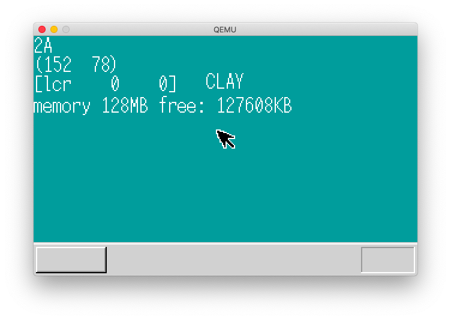
### day10 叠加处理
- 整理文件
- 继续改善内存管理，考虑到进行大量的内存分配释放后，内存中会出现不连续的空闲碎片，占用`man->frees`段数量
- 编写总是以 0x1000 字节（4KB）为单位进行分配或释放的函数，采用与运算进行舍入运算
- 通过内存管理的思想创建一个图层渲染管理（叠加处理）的函数
- 通过结构体`SHEET`记录图层的各种信息，`SHEETCTL`结构体对所有图层进行记录管理，设置图层最多 256 个
- 编写画面刷新函数，使用透明色对鼠标的背景颜色进行重新绘制
- 全局画面刷新性能太差，采用局部刷新，提高画面刷新的速度和性能
- haribote.sys - 10.8KB
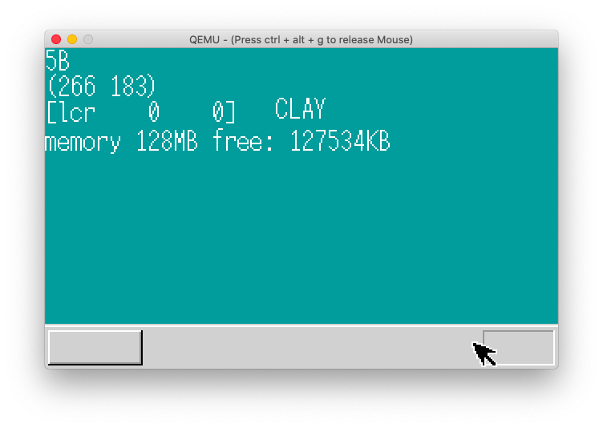

### day11 制作窗口
- 鼠标显示问题，设置为可以隐藏，让局部刷新函数不刷新画面外的内容（增加`if`判断限制范围）
- 简化`sheet.c`的函数调用，将`SHTCTL`设置到`sheet`层级窗口内部
- 添加了绘制窗口的函数`make_window8`，修正了字体`hankaku`
	- 关闭按钮来自鼠标绘制算法
	- 窗体修改了初始化屏幕算法
- 添加一个层级（一下统称窗口）时的步骤：
	```c
	// 声明此窗口的缓冲区
	unsigned char *win_buf;
	// 向层级管理中注册此窗口
	sht_win = sheet_alloc(SHTCTL);
	// 向内存管理器申请内存 160 * 68 = 10880
	win_buf = (unsigned char *) memman_alloc_4k(memman, 160 * 68);
	// 设置窗口的信息
	sheet_setbuf(sht_win, buf_win, 160, 68, -1);
	// 创建窗口
	make_window8(buf_win, 160, 68, "Window");
	// 设置窗口在移动时能够进行叠加刷新
	sheet_slide(sht_win, 80, 72);
	// 设置窗口叠加显示的优先级
	sheet_updown(sht_win, 1);
	```
- 添加高速计数器窗口，但是显示的内容在闪烁，判断应该是`sheet_refresh`的问题
	- `sheet_refresh`思想：从显示优先度低的先刷新，然后到高的刷新
	- 既然`Windows`没有这种闪烁，就肯定有解决办法
- 消除了窗口的闪烁，在`sheet_refresh`函数里添加了一个高度参数，只有此高度以上的窗口才进行刷新，但是鼠标会闪烁
	- 思路：在鼠标所在的`VRAM`不进行处理
- 在内存开辟一块空间存放`VRAM`的映射，储存在`struct SHTCTL->vmap`，用图层号码而不是色号存入内存地址
- 每一次画面的变动都会相应的在`SHTCTL->vmap`记录，在`sheet_refreshsub`改动使其每次对照`vmap`的内容对`vram`进行写入
- 避免从下往顶刷新，创建高度限定参数`h1`，对调用`sheet_refreshsub`的其他函数进行修改
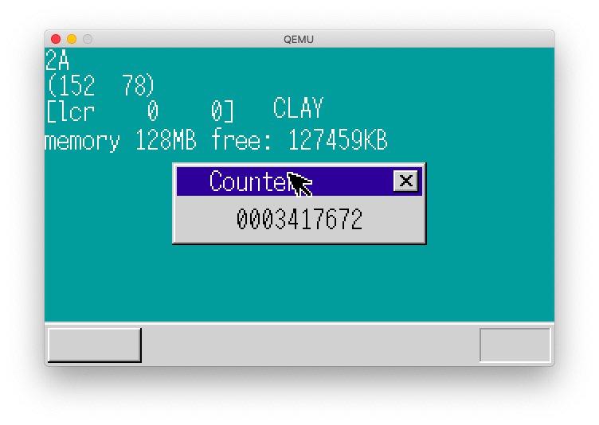

### day12 定时器
- 使用定时器（PIT Programmable Interval Timer）
- 要管理定时器需要对定时器进行设定
- 定时器在以前是作为单独的芯片安装在主板上，现在和 PIC 一样被集成到了其他芯片里
- 连接 IRQ（引脚） 的 0 号，只要设定了 PIT 就可以设定 IRQ0 的中断间隔
```asm
; IRQ0 的中断周期变更
AL= 0x34:OUT(0x43,AL)
AL= 中断周期的低 8 位 ;OUT(0x40,AL)
AL= 中断周期的高 8 位 ;OUT(0x40,AL)
; 中断产生的频率 = 主频 / 设定的数值
; 指定中断周期为 0，默认为 65536
; 设定周期为 1000，中断产生的频率为 119.318HZ
; 设定为 11932，频率就是 100HZ
; 11932 = 0x2e9c
```
- 从`IRQ0`的中断变更可以看出需要执行 3 次 OUT 指令来完成设定，第一个指令的输出地址为 0x43，激活`IRQ0`中断
```c
#define PIT_CTRL	0x004
#define PIT_CNT0	0x0040

void init_pit()
{
	io_out8(PIT_CTRL, 0x34);
	io_out8(PIT_CNT0, 0x9c);
	io_out8(PIT_CNT0, 0x2e);
}
```
- 在中断记录表里注册计时器中断在`0x20`地址
- 使用 `PIT` 记录开机时间
	- 定义`struct TIMERCTL`，定义一个`count`变量
	- 初始化时设置`count = 0`，每次发生中断时，`count++`
- 设置一个定时器，到达时间后显示
	- 此时的`TIMERCTL`
```c
// 计时器管理
// 计时 count
// 剩余时间 timeout
// 缓冲区 fifo
// 剩余时间没有后需要向缓冲区写入的数据 data
struct TIMERCTL {
	unsigned int count;
	unsigned int timeout;
	struct FIFO8 *fifo;
	unsigned char data;
};
```
	- 写一个倒计时函数`settimer()`
	- 在`bootpack.c`中进行相应的处理
- 设置多个定时器，思路和图层管理器一样，设置一个定时器管理，预先设置好最多能有`500`个定时器
- 绘制闪烁光标，方便以后使用在文本编辑器，终端等应用场景中
- 加快中断处理 `timeout`不再是剩余时间，而是给定的计时时间，免除了每次中断处理需要当前活动计时器的`timeout`自减的操作
- 由于`timectl.count`的类型是`int`，最大值为`0xffffffff`，不能无限制计时，设定为 1 年时间后计时器归零
	- 或许有更好的方法，是否应该储存为年月日时分秒形式？
- 再次加快中断处理
	- 原`timer.c`中断处理
```c
// 定时器中断处理
void inthandler20(int *esp)
{
	int i;
	io_out8(PIC0_OCW2, 0x60);	// 把 IRQ-00 信号接收完了的信息通知给 PIC
	timerctl.count++;
	for (i = 0; i < MAX_TIMER; i++) {
		if (timerctl.timer[i].flags == TIMER_FLAGS_USING) {
			if (timerctl.timer[i].timeout <= timerctl.count) {
				timerctl.timer[i].flags = TIMER_FLAGS_ALLOC;
				fifo8_put(timerctl.timer[i].fifo, timerctl.timer[i].data);
			}
		}
	}
}

```

	由于设置的 1ms 发生一次中断，1s = 100 次中断，MAX_TIMER = 500，所以 1s 执行 50000 次 if，49998 次是无用功
- 添加`timerctl.next`优化`timer.c` - 短时先判断
- 继续优化中断处理，用`struct SHTCTL`思路在`struct TIMERCTL`中创建一个排序好的`timers`
- haribote.sys 23.1KB
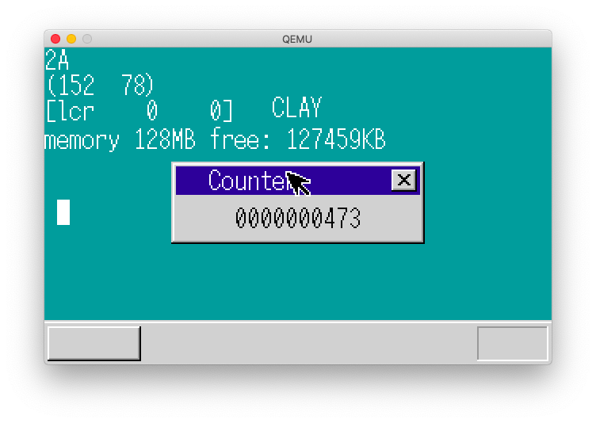
### day13 继续优化定时器
- 修复了 day12 的 bug，应该是 `j > i` 而不是 `j < i`
- 简化叠加处理字符串显示
- 调整计时器缓冲区 `timerfifo`，优化了过程
- 性能测试

| 版本  | 虚拟机    |
|-------|-----------|
| day12 | 113228031 |
| day12 | 115222105 |
| day12 | 115367183 |
| day12 | 114781422 |

- 整合缓冲区，`timer, keyboard, mouse` 使用一个缓冲区 `struct FIFO32 *fifo`
- 性能测试

| 版本  | 虚拟机    |
|-------|-----------|
| day13 | 211905694 |
| day13 | 212633087 |
| day13 | 211646820 |
| day13 | 211641338 |

- 整合缓冲区后性能提升 1.85 倍
- 加快中断处理
	- 用单向链表管理 `timers`，`timer->next` 指向下一个定时器地址，提高性能
- 设置哨兵在`timer.c`中简化程序，使`timer_settime()`从 4 种情况变为 2 种
- haribote.sys - 22.9KB
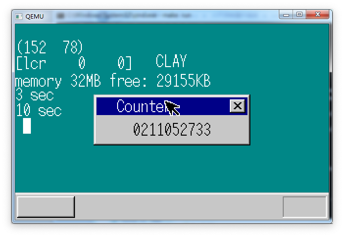
### day14 提高分辨率和键盘输入
- 提高分辨率，通过修改 BIOS 的 13 号中断，用汇编向累加寄存器写入模式
- 资料

	每次发布新显卡时，分辨率，性能都会提高，以前是 IBM 公司决定电脑各种规格（比如画面规格），所以厂商就迎合规格来制作显卡
	但是慢慢显卡公司的技术超越的 IBM，在 IBM 发布规格前就出现了各种画面模式的显卡，显卡公司竞争激烈，显示模式百花齐放
	由于画面模式太多，所以显卡公司成立了 VESA 协会（Video Electronics Strandards Association 视频电子标准协会）
	此协会制定了通用的（generic）显示设定方法，制作了专用的 BIOS 功能 VEB（VESA BIOS extension）
	使用 VBE 就可以使用显卡的高分辨率功能

- 切换到不用 VBE 的画面模式用
```asm
AH=0
AL= 画面模式号码
```
- 切换到使用 VBE 的画面模式用
```asm
AX=0x4f02
BX= 画面模式号码
```
- VBE 画面模式号码如下

| 号码  | 画面模式       |
|-------|----------------|
| 0x101 | 640x480x8bit   |
| 0x103 | 800x600x8bit   |
| 0x105 | 1024x768x8bit  |
| 0x107 | 1280x1024x8bit |

- 兼容真机，先判断是否有支持此类画面模式的显卡，如果没有，禁用 VBE，写入在`asmhead.nas`
- 画面模式信息

| 大小  | 地址         | 解释                             |
|-------|--------------|----------------------------------|
| WORD  | [ES:DI+0x00] | 模式属性，第七位不是 1 就不好整  |
| WORD  | [ES:DI+0x12] | X 分辨率                         |
| WORD  | [ES:DI+0x14] | Y 分辨率                         |
| BYTE  | [ES:DI+0x19] | 颜色必须为 8bit                  |
| BYTE  | [ES:DI+0x1b] | 颜色指定方法必须为 4（调色模式） |
| DWORD | [ES:DI+0x28] | VRAM 的地址                      |

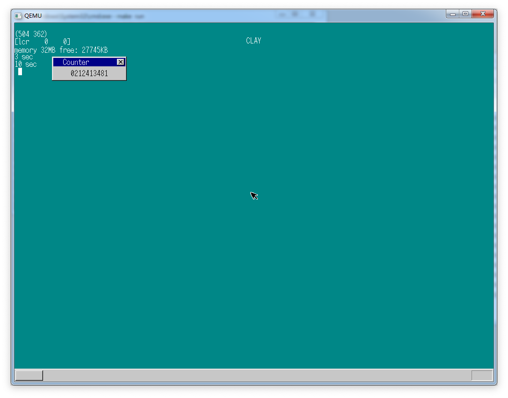

- 开发键盘输入
- 开发输入框和输入光标
- 修复了窗口外渲染的 bug，之前一直没有发现，理论上性能应该在修复后有所提升
- 添加了拖动窗口的支持
- 修复了纵向窗口外渲染的 bug，希望没有渲染的 bug 了
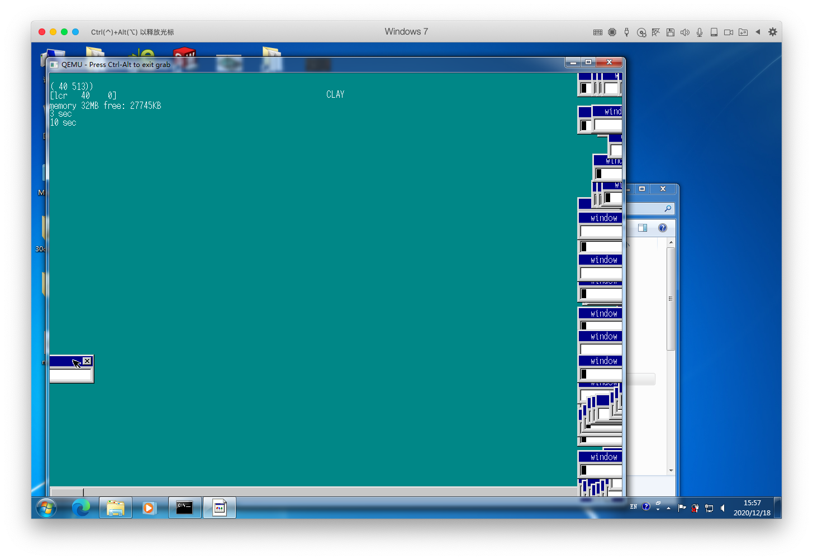

- haribote.sys - 23.6KB
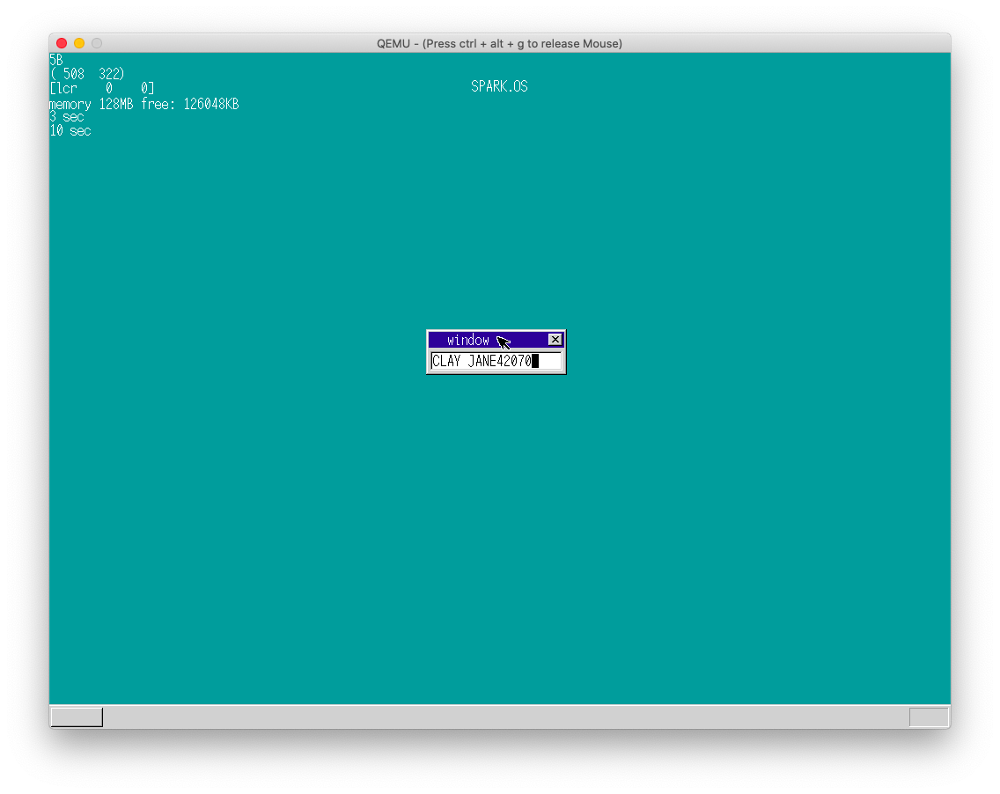

### day15 多任务并发
- `struct TSS` 任务状态段
- 通过`JMP 3 * 8:0x00000000 far jump`

```asm
JMP 0x1234
; 就是
MOV EIP,0x1234
```
- 使用定时器 0.02s 进行一次任务切换
- 实现了多任务并发
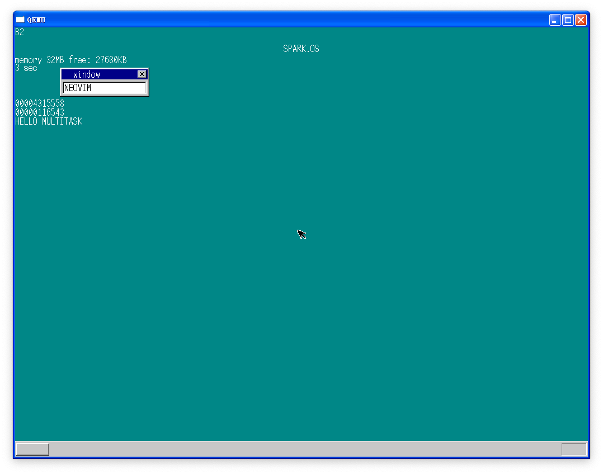

### day16 继续多任务
- 通过层级管理器 `struct SHEETCT` 的思路创建自动化的任务管理器 `struct TASKCTL`

| func          | work                         |
|---------------|------------------------------|
| task_init()   | 对所有的预分配任务进行初始化 |
| task_alloc()  | 分配一个任务                 |
| task_run()    | 运行任务                     |
| task_switch() | 让任务并发执行               |

- 实现任务自动休眠和唤醒
- 当多个任务同时在运行时，会出现有些任务频繁运行的需求没有这么高的情况，让其他任务全力运行，需求少的先休眠，当需要时再将其唤醒
- 思路：确定需要休眠的任务，判断任务是否处于激活状态，如果处于则需要在任务休眠后进行任务交换`ts = 1`，再查找当前任务再任务管理器中的位置，将其`task->flag`置为未运行状态，然后将`taskctl->now--`，再将`taskctl`中的运行的任务组进行移位操作，在判断`ts == 1`，进行任务跳转
- 自动激活则判断`FIFO`缓冲区是否有此任务的数据写入，如果有则激活该任务，需修改`fifo.c`
- 将 `task` 添加到`FIFO`缓冲区结构体中，这样就免去了判断是哪个任务在缓冲区写入数据的麻烦
```c
struct FIFO32 {
	int *buf;
	int w, r, size, free, flags;
	struct TASK *task;
};
```
- 实现完成，测试性能
- 性能比之前提升 2.19 倍左右
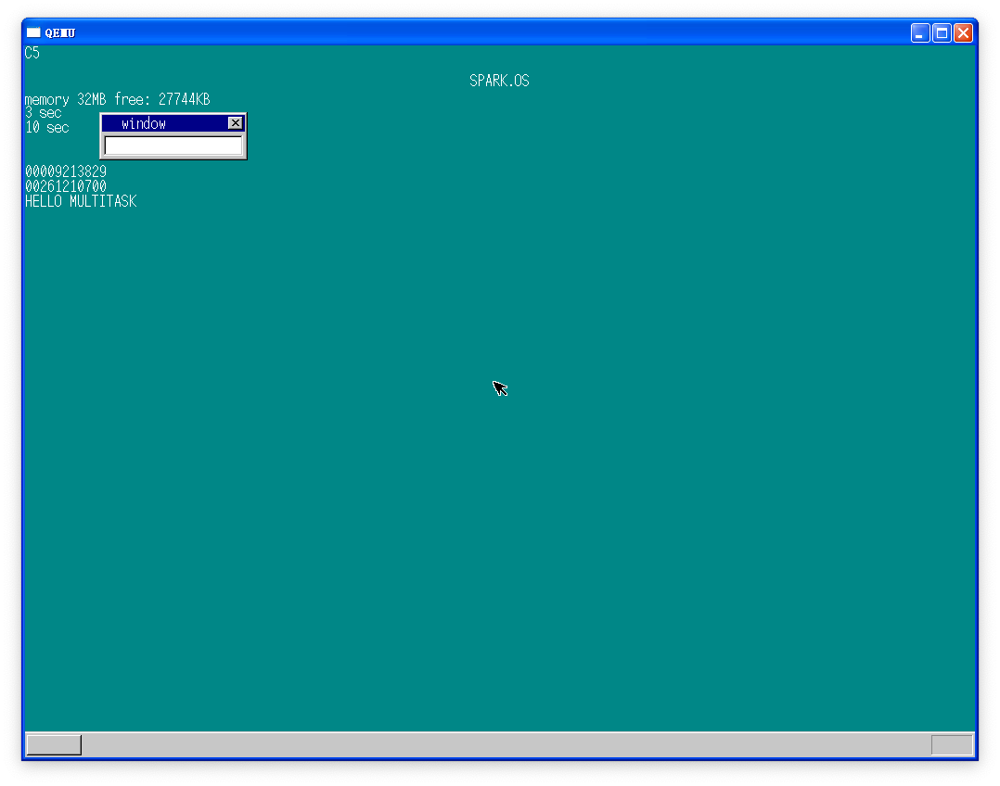
- 增加窗口数量，更多的任务
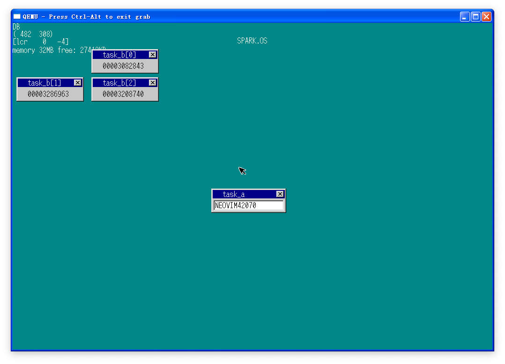
- 整理代码结构并优化，进行真机测试

| OS       | task_b[0] | task_b[1] | task_b[2] |
|----------|-----------|-----------|-----------|
| spark    | 47355888  | 47350753  | 47355859  |
| haribote | 44651103  | 44829920  | 44748655  |

- 提升了 17.4% 的性能
- 设置任务优先级
	- 有些时候需要任务进行全力运行，多个任务公平分配资源会让需要全力运行的任务表现无法达到预期
	- 任务切换间隔从 0.02 秒修改为 0.01 秒~0.1 秒的范围，通过延长切换的时间间隔使任务全力运行更长的时间，达到最大 10 倍的优先级差异
```c
struct TASK {
	int sel, flags;		// sel 代表 GDT 编号
	int priority;		// 任务优先级
	struct TSS32 tss;	// 任务的属性
}
```
- 思路：任务被创建时默认优先级为 0.02 秒，通过`task_run()`方法可以在启动任务的同时设定优先级，在进行任务切换的时候`task_switch()`进行优先级的定时器设置，判断当前任务是否有多个，决定是否执行任务切换`farjmp(0, task->sel)`，修改`fifo32_put()`中的激活任务`task_run(fifo->task, 0)`，将优先级设置为 0，立即激活任务
- 修改`bootpack.c`让`task_b[]`优先级变为`1, 2, 3`
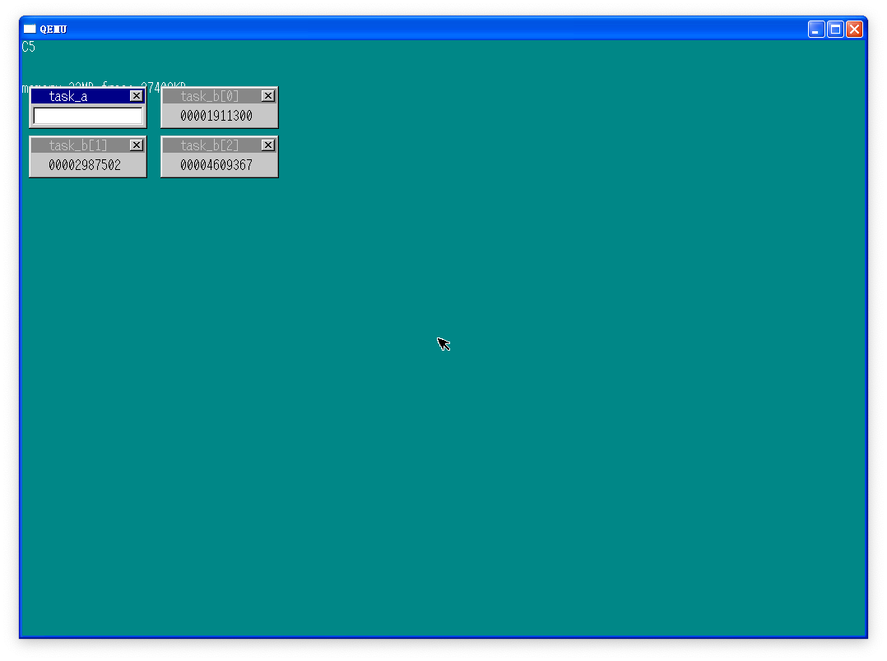
- 处理速度正好是 1, 2, 3 倍，成功
- 继续设定任务优先级
- 问题
	1. 鼠标移动速度很卡顿，特别是拖动窗口时
	2. 如果相同高优先级的任务太多，他们最多为 1s 切换，这样就明显看得出系统卡顿，同优先级的任务应该在短时间内互相切换，比如 0.02s

- 思路：创建多个优先级的任务容器，当高级别的任务容器有任务运行时，低级别的全部休眠，直到高级别的任务运行全部完成
- 当拖动鼠标和窗口时，`task_b[]`处理速度下降，目标实现
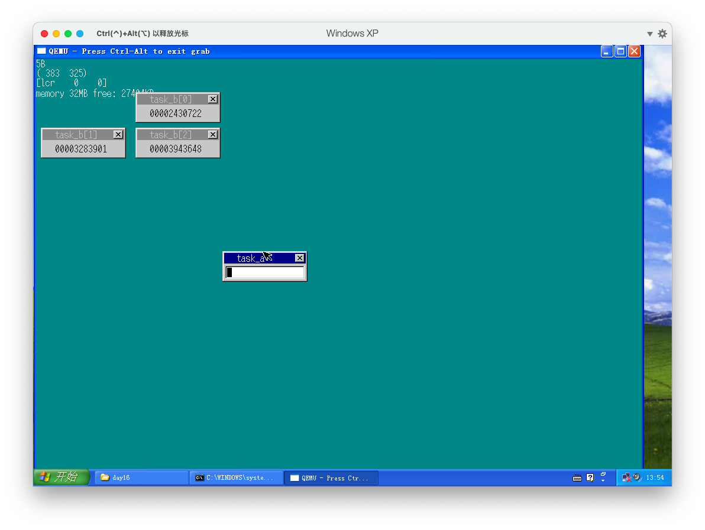

### day17 实现命令行窗口
- 在 day16 中，任务 A 下面的 LEVEL 中有任务 B0~B2，因此 FIFO 为空时可以让任务 A 进入休眠状态，如果并没有启动其他任务，只有一个任务 A 的话，会怎么样呢？
- 如果不对 A 任务进行改写，进入休眠状态后任务管理器就会寻找其他任务，但是并没有其他任务，就会进入异常
- 改进思路
	- 在 LEVEL 中没有任务的时候，进行 HLT
	- 创建一个哨兵（一个永远存在的任务）
	- 在任务管理器初始化的时候创建哨兵
	- 哨兵的优先级为最低，10 级，不会抢占其他任务的资源，只是起监视作用
```c
// 哨兵
void task_idle()
{
	for (;;) io_hlt();
}

// task_init() 节选
// 哨兵初始化
idle = task_alloc();
idle->tss.esp = memman_alloc_4k(memman, 64 * 1024) + 64 * 1024;
idle->tss.eip = (int) &task_idle;
idle->tss.es  = 1 * 8;
idle->tss.cs  = 2 * 8;
idle->tss.ss  = 1 * 8;
idle->tss.ds  = 1 * 8;
idle->tss.fs  = 1 * 8;
idle->tss.gs  = 1 * 8;
task_run(idle, MAX_TASKLEVELS - 1, 1);
// bootpack.c 节选
// 注释 task_run(task_b[i], 2, i + 1);
```
- 测试单独执行任务的情况
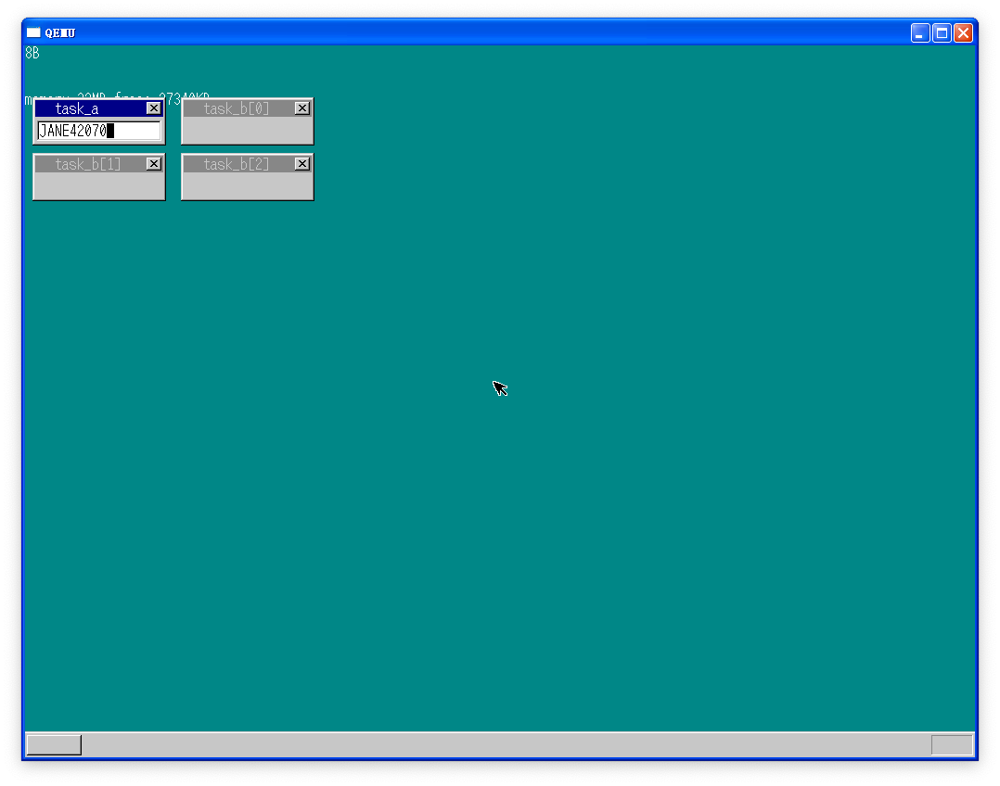
- 编写终端
- 我很喜欢命令行界面，命令行能给我自在的感觉
- 制作终端窗口`task_cons`和终端下的`blinking cursor`
- 实现`<TAB>`窗口切换


- 实现字符输入
- 思路
	- 只要在键盘按下的时候向 `console_task`的缓冲区`FIFO`发送数据即可，将`FIFO`加入`struct TASK`
- 解决符号输入

| 键位   | 按下 | 抬起 |
|--------|------|------|
| rShift | 0x2a | 0xaa |
| lShift | 0x36 | 0xb6 |

- 定义一个`int key_shift`
	- lShift 按下时`key_shift = 1`
	- rShift 按下时`key_shift = 2`
	- 都按下时`key_shift = 3`
- 通过`key_shift`的值判断需要用哪套字符编码
- 添加大小写字母输入

| 位置                  | 状态            |
|-----------------------|-----------------|
| binfo->leds 的第 4 位 | ScrollLock 状态 |
| binfo->leds 的第 5 位 | NumLock 状态    |
| binfo->leds 的第 6 位 | CapsLock 状态   |

- 完成对小写字母输入支持
- 对各种锁定键的支持

| 编码 | 键位       |
|------|------------|
| 0x3a | CapsLock   |
| 0x45 | NumLock    |
| 0x46 | ScrollLock |

- 参考 os.dev 的 (AT)Keyboard 支持对键盘 led 灯的控制

- 关于 LED 的控制
	- 对于 NumLock 和 CapsLock 等 LED 的控制，可采用下面的方法向键盘发送指令和数据
		- 读取状态寄存器，等待 bit1 的值变为 0。
		- 向数据输出（0060）写入要发送的 1 个字节数据。
		- 等待键盘返回 1 个字节的信息，这和等待键盘输入所采用的方法相同（用 IRQ 等待或者用轮询状态寄存器 bit1 的值直到其变为 0 都可以）
		- 返回的信息如果为 0xfa，表明 1 个字节的数据已成功发送给键盘。如为 0xfe 则表明发送失败，需要返回第 1 步重新发送
	- 要控制 LED 的状态，需要按上述方法执行两次，向键盘发送 EDxx 数据。其中，xx 的 bit0 代表 ScrollLock，bit1 代表 Numlock，bit2 代表 CapsLock（0 表示熄灭，1 代表点亮）。bit3~7 为保留位，置 0 即可。
- 思路，因为向键盘控制器发送指令激活 led 灯的时候，键盘会返回是否成功的数据，创建一个键盘缓冲区`keycmd_buf[32]`接收键盘控制器返回的值，通过`io_out8()`对键盘控制器发送数据，通过检查缓冲区中的值查看 led 是否点亮，`wait_KBC_sendready()`等待键盘控制电路发送数据，如果控制电路返回失败，则重新发送

### day18 终端命令
- 在当前窗口闪烁光标，而不是全局闪烁光标，参考至 Windows
- 实现任务 A 的光标闪烁
- 控制命令行的光标闪烁

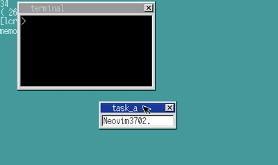

- 添加对回车键的支持

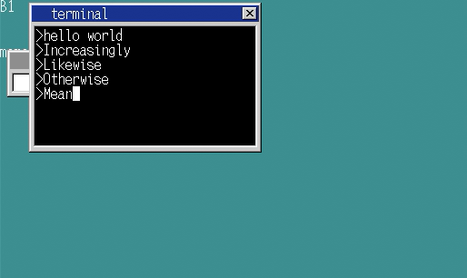
